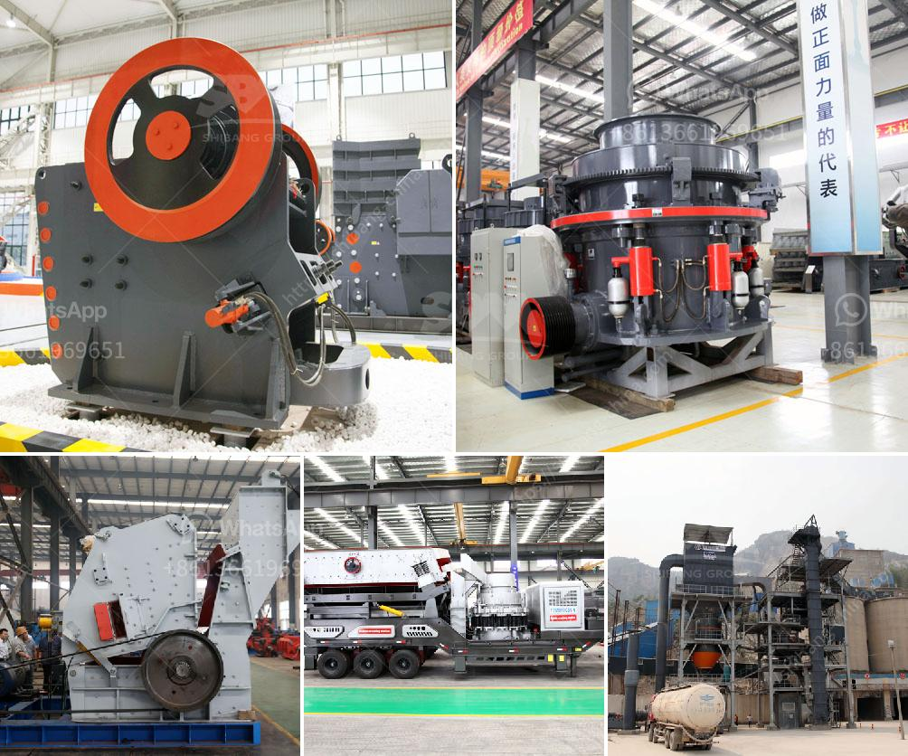

<h3>100tph stone crusher plant</h3>
A stone crusher plant, also commonly known as a rock crusher plant, is a versatile and cost-effective machinery abbreviated as crusher plants, which are used for crushing rocks and stones into smaller sizes to facilitate marketable products. Crusher plants consist of different types of machinery depending on the needs of the customers.

Typically, crusher plants are designed with a capacity range of 50-500 TPH. Nowadays, with the advancement of technology, the performance of equipment has been continuously improved and updated, and the structure has become more and more advanced. The advanced features of a crusher plant include a vibrating feeder, jaw crusher, impact crusher, vibrating screen, belt conveyor, and the centralized electric control system. These types of machinery are designed to meet a specific customer's requirements and improve efficiency.

In recent years, the popularity of using crushing plants has increased significantly, and due to the advantages associated with them, more construction companies are preferring them over traditional methods of crushing. This is mainly because crusher plants are more versatile and flexible, allowing you to produce various marketable products with a single machine. Moreover, it provides a low-cost means of production that allows contractors to save money on labor and other expenses.

A 100 TPH crusher plant can be used to crush various types of ores and rocks with the compressive strength between 147 and 245 MPa. Such as granite, basalt, limestone, river stone, cobblestone, and other materials. If you need to know more about the crushing plants that are suitable for your project, please consult House Demo Crusher Machine.

Generally, the hopper in a crusher plant can hold up to 2-3 truckloads of materials. The vibrating feeder can transport the materials to the next jaw crusher for primary crushing. This crushing process involves the breaking down of large chunks of stones into smaller pieces. The jaw crusher can withstand large and hard-to-break pieces of rocks and reduces them to medium-sized rocks.

After the primary crushing process, the stones are conveyed to impact crusher or cone crusher for secondary crushing through belt conveyor. Depending on the requirements, cone crushers are used in the secondary and tertiary stages for crushing medium-hard to hard rocks. On the other hand, impact crushers are used in the primary and secondary stages for crushing soft to medium-hard rocks.

The crushed stones are then screened through a vibrating screen to separate different sizes of stones. The stones that meet the requirements of the customers' specifications are sent to the finished product stack by the belt conveyor, while the unsuitable stones are returned to the impact crusher or cone crusher through the circular vibrating screen for further crushing.

In conclusion, a stone crusher plant is a valuable addition to any construction site. With the increasing demand for small-sized products globally, using a stone crusher plant allows you to operate on-site crushing operations, reducing transportation costs, and minimizing the pollution caused by the constant relocation of plants. It empowers you to generate high-quality aggregates and building materials, thus ensuring the success of your construction projects.
<h3>Contact us</h3><ul><li><strong>Whatsapp:&nbsp;<a href="https://wa.me/8613661969651">+8613661969651</a></strong></li><li><a href="https://swt.shibang-china.com/?git&amp;zhl&amp;100tph stone crusher plant"><strong>Online Service(chat now)</strong></a></li></ul><h3>Related</h3><ul><li><a href='gold mining equipment for sale at malaysia.md'>gold mining equipment for sale at malaysia</a></li><li><a href='list of equipments needed to start gold mining.md'>list of equipments needed to start gold mining</a></li><li><a href='buy ball mill india.md'>buy ball mill india</a></li><li><a href='crusher dimensions crusher conica.md'>crusher dimensions crusher conica</a></li><li><a href='calcite and dolomite plant process.md'>calcite and dolomite plant process</a></li></ul>