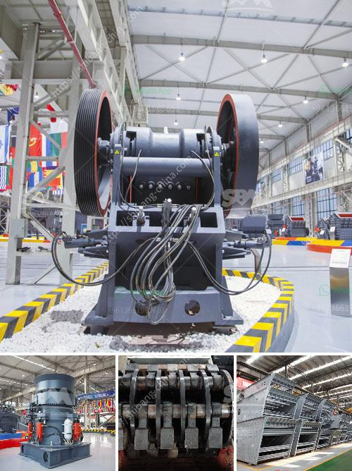

<h3>100tph wet grinding mill</h3>
A wet grinding mill is a versatile piece of equipment that allows you to grind wet materials into fine particles. In the mining industry, it is often used for the grinding of gold, copper, iron ore, and other minerals. Wet grinding mills are commonly used in the cement and limestone industries, where the raw materials are ground into a fine slurry and then dried before being mixed with other materials to form a final product.

One such wet grinding mill is the 100tph wet grinding mill. This mill is designed to grind wet materials with a feed size of up to 25mm and a product size of 325 mesh. With a capacity of 100tph, this mill is suitable for large-scale grinding operations.

The 100tph wet grinding mill is equipped with a variety of features that ensure high performance and reliable operation. The mill's large diameter trunnion-mounted shell is designed to withstand the high loads generated by the grinding process. It is lined with wear-resistant materials to prolong its service life.

Another feature of this wet grinding mill is its heavy-duty motor. The powerful motor ensures that the mill can handle the high loads and provide efficient grinding. The mill also features a robust gearbox, which provides smooth operation and allows for easy maintenance.

In addition to its high-performance features, the 100tph wet grinding mill also offers flexibility in terms of the materials it can process. It can handle a variety of wet materials, including ores, minerals, and slurry. This versatility makes it a valuable tool for the mining and cement industries.

In conclusion, the 100tph wet grinding mill is a reliable and efficient grinding equipment that is suitable for large-scale grinding operations. Its high-performance features and versatility make it an ideal choice for the mining and cement industries. Whether you are grinding gold, copper, iron ore, or other minerals, this wet grinding mill will provide the efficiency and reliability you need.
<h3>Contact us</h3><ul><li><strong>Whatsapp:&nbsp;<a href="https://wa.me/8613661969651">+8613661969651</a></strong></li><li><a href="https://swt.shibang-china.com/?git&amp;zhl&amp;100tph wet grinding mill"><strong>Online Service(chat now)</strong></a></li></ul><h3>Related</h3><ul><li><a href='crusher in sri lanka.md'>crusher in sri lanka</a></li><li><a href='jaw crusher in south africa.md'>jaw crusher in south africa</a></li><li><a href='stone crush plant 4tph.md'>stone crush plant 4tph</a></li><li><a href='alluvial mobile diamond processing plant.md'>alluvial mobile diamond processing plant</a></li><li><a href='crusher equipment in sweden.md'>crusher equipment in sweden</a></li></ul>