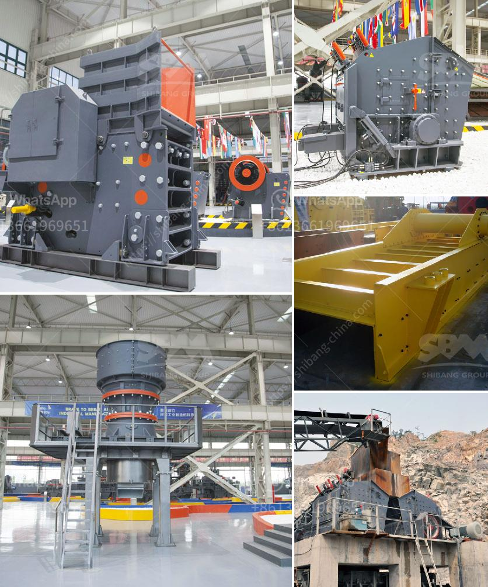

<h3>15 tph cement grinding unit</h3>
A cement grinding unit, or simply called cement grinding plant, is a separate facility that grinds cement clinker into various types of cement, such as Portland, Pozzolana, and Fly Ash cement. The finished cement is then sold and distributed to end-users across the world. Cement manufacturers utilize this process in their plants, primarily for producing blended cement mixtures, high strength varieties, and specialty cements. With increasing demand for cement globally, the need for grinding units continues to grow.

One such grinding unit is designed with a capacity of 15 tons per hour. This unit is ideal for small-scale cement plants or construction companies that want to reduce their carbon footprint. It can grind a variety of cement types, including Portland, Pozzolana, and Fly Ash cement, as well as slag cement if required.

The unit consists of a ball mill, hopper, feeder, classifier, and bag filter. The facility utilizes advanced technology and state-of-the-art equipment to deliver high-quality cement at optimal efficiency. The grinding unit is energy-efficient and consumes less power, resulting in reduced operating costs for the cement plant.

The unit is also designed to be environmentally friendly with minimal dust emissions and noise pollution. The bag filter helps capture particulate matter released during the grinding process, ensuring a clean and healthy working environment.

Additionally, the grinding unit is compact, requiring less space for installation. It can easily be integrated into existing cement plants without disrupting production. This makes it a cost-effective and time-saving solution for cement manufacturers.

In conclusion, a 15 tph cement grinding unit is an ideal solution for smaller-scale cement producers looking to expand their operation and reduce overall costs. With the benefits of compact design, energy efficiency, and environmental friendliness, it provides high-quality cement at affordable prices. As the demand for cement continues to rise, the need for efficient grinding units will only grow stronger.
<h3>Contact us</h3><ul><li><strong>Whatsapp:&nbsp;<a href="https://wa.me/8613661969651">+8613661969651</a></strong></li><li><a href="https://swt.shibang-china.com/?git&amp;zhl&amp;15 tph cement grinding unit"><strong>Online Service(chat now)</strong></a></li></ul><h3>Related</h3><ul><li><a href='big slage crusher mechins plant.md'>big slage crusher mechins plant</a></li><li><a href='grinding machine manufacturers and suppliers in india.md'>grinding machine manufacturers and suppliers in india</a></li><li><a href='spare parts dealer of crusher plant in odisha.md'>spare parts dealer of crusher plant in odisha</a></li><li><a href='silica sand production line stone crusher machine.md'>silica sand production line stone crusher machine</a></li><li><a href='gypsum crushing machines.md'>gypsum crushing machines</a></li></ul>