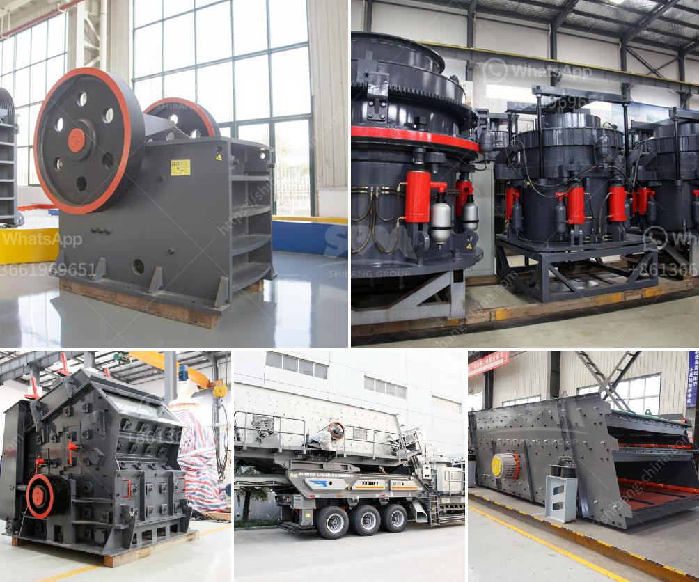

<h3>200tph stone hammer mill</h3>
The 200tph stone hammer mill is widely used in the mining industry, especially in the cement, construction, and chemical industries. It is used for crushing medium-hard and brittle materials, such as limestone, coal and cement clinker.

The 200tph stone hammer mill consists of several parts, such as crushing chamber, rotor, Hammer, sieve plate, and electric motor. The motor drives the rotor to rotate at a high speed through the belt, and on the rotor there are several hammers constantly hitting the materials. The materials are crushed by the hammers on the rotor and then discharged through the sieve plate.

The advantages of the 200tph stone hammer mill are its simple structure, high crushing ratio, low energy consumption, and uniform final product size. Compared with other types of crushers, such as jaw crusher and impact crusher, the hammer mill has a lower investment cost and higher production efficiency. It can crush materials with a maximum particle size of 600-1800mm and a compressive strength of less than 200MPa.

The 200tph stone hammer mill is suitable for crushing all kinds of medium-hard and brittle materials, such as limestone, coal, salt, gypsum, brick, and tile. It is widely used in cement, chemical, electric power, metallurgy, and other industrial sectors. In the cement industry, it is mainly used for crushing limestone and clinker. In the chemical industry, it is used for crushing coal and salt. In the construction industry, it is used for crushing bricks and tiles.

To improve the efficiency of the 200tph stone hammer mill, regular maintenance is required. The maintenance includes lubrication of the bearing, cleaning of the crushing chamber, balancing of the rotor, and inspection of the hammer and sieve plate. Regular maintenance can not only extend the service life of the machine but also ensure its normal operation.

In conclusion, the 200tph stone hammer mill is a reliable and efficient crushing machine that is widely used in the mining industry. It has the advantages of simple structure, high crushing ratio, low energy consumption, and uniform final product size. It is suitable for crushing medium-hard and brittle materials, such as limestone, coal, and cement clinker. Regular maintenance is necessary to ensure its smooth operation and prolong its service life.
<h3>Contact us</h3><ul><li><strong>Whatsapp:&nbsp;<a href="https://wa.me/8613661969651">+8613661969651</a></strong></li><li><a href="https://swt.shibang-china.com/?git&amp;zhl&amp;200tph stone hammer mill"><strong>Online Service(chat now)</strong></a></li></ul><h3>Related</h3><ul><li><a href='harga sewa beli stone crusher kapasitas 30 ton per jam.md'>harga sewa beli stone crusher kapasitas 30 ton per jam</a></li><li><a href='used hammer mill.md'>used hammer mill</a></li><li><a href='clay aggregate machinery product.md'>clay aggregate machinery product</a></li><li><a href='scale gold mining business plan.md'>scale gold mining business plan</a></li><li><a href='marble ball mill.md'>marble ball mill</a></li></ul>