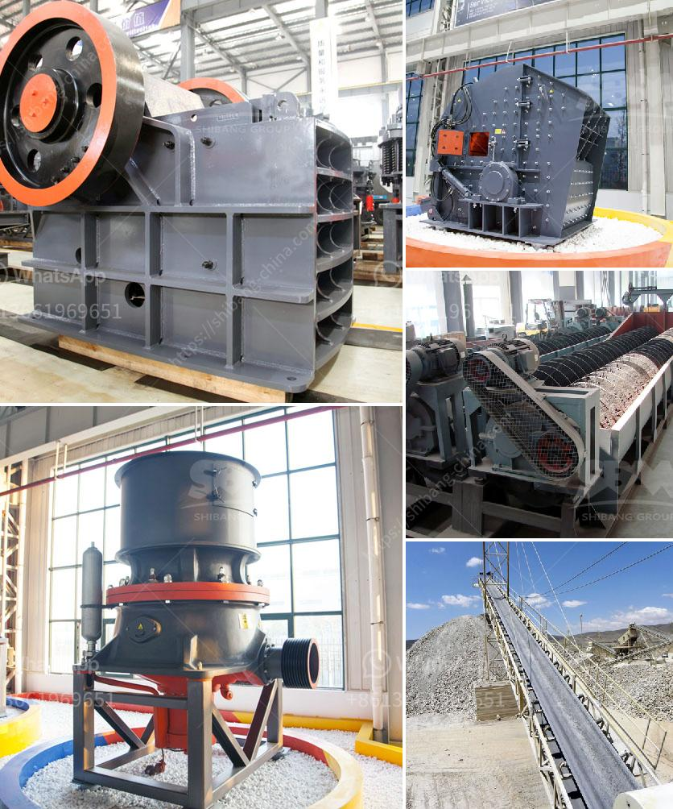

<h3>200tph vsi crushers</h3>
When it comes to crushing rocks, there is one machine that has been revolutionizing the industry for decades - the VSI crusher. VSI, or Vertical Shaft Impactor, crushers are known for their ability to produce finely graded cubical shaped aggregates, making them popular in the construction and mining industries. In this article, we will explore the benefits and features of 200tph VSI crushers.

A 200tph VSI crusher refers to a machine that crushes a specific output size of stone, such as 0-20mm. This means that the machine can effectively crush and shape the stone to the specified size, ensuring that it meets the project requirements. With a maximum feed size of up to 50mm, these crushers can handle a wide range of materials, including hard and abrasive ones.

One of the main advantages of a 200tph VSI crusher is its versatility. It can be used in various applications, from producing high-quality aggregates for road construction, concrete production, and asphalt mixing plants to manufacturing sand for the construction industry. Its ability to produce a well-graded product with minimal fines makes it a preferred choice among contractors and engineers.

Another key feature of these crushers is their high production capacity. With a 200tph VSI crusher, you can expect to get a significant amount of output, ensuring that your crushing needs are met efficiently. The machine is equipped with a powerful motor that enables it to handle large quantities of stone, resulting in increased productivity.

Furthermore, 200tph VSI crushers are known for their low maintenance requirements. With minimal wear parts and a simple design, these machines are built to withstand the harsh conditions of the crushing environment. This translates to reduced downtime and increased operational efficiency, saving you time and money in the long run.

In conclusion, a 200tph VSI crusher is a reliable and efficient machine for crushing rocks and producing high-quality aggregates. Its versatility, high production capacity, and low maintenance requirements make it an excellent choice for various applications in the construction and mining industries. So, if you are looking to enhance your crushing operations, consider investing in a 200tph VSI crusher - it might just be the heartbeat your project needs.
<h3>Contact us</h3><ul><li><strong>Whatsapp:&nbsp;<a href="https://wa.me/8613661969651">+8613661969651</a></strong></li><li><a href="https://swt.shibang-china.com/?git&amp;zhl&amp;200tph vsi crushers"><strong>Online Service(chat now)</strong></a></li></ul><h3>Related</h3><ul><li><a href='working of ball mill in hindi.md'>working of ball mill in hindi</a></li><li><a href='stone jaw crusher for rock crushing.md'>stone jaw crusher for rock crushing</a></li><li><a href='american cone crushers.md'>american cone crushers</a></li><li><a href='crushing machines for rent in uae.md'>crushing machines for rent in uae</a></li><li><a href='cost estimate ball mill.md'>cost estimate ball mill</a></li></ul>