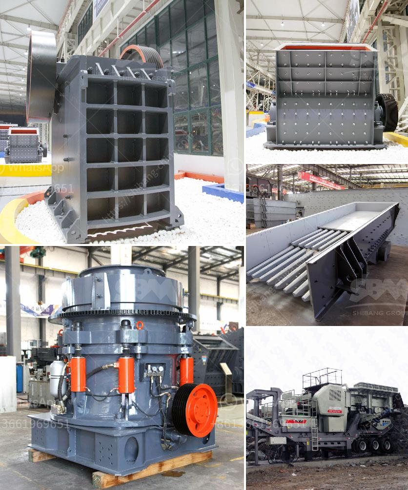

<h3>250tph capacity of stone crusher</h3>
250tph stone crusher refers to the full capacity stone crusher machine. It mainly consists of jaw crusher, ball mill, classifier, ball mill, and other related equipment such as feeder, conveyor belt, and vibrating screen. The output of this production line is 250 tons per hour, which is the most common production line in many current stone processing factories. It is designed for crushing and screening of medium-sized hard materials, such as limestone, basalt, and granite.

The stone crusher machine in this production line can be adjusted to meet different particle size requirements. The crusher machine capacity for large stones is approximately 600-800t/h. Depending on the production needs, various vibrating screens are added to achieve the required finished product sizes. These machines work together to complete the stone crushing process, ensuring high output and reliable performance.

The 250tph stone crusher produces uniform particles, making it suitable for construction projects, such as bridges, highways, railways, airports, and commercial buildings. When the materials flow into the crusher cavity, they are subjected to the impact of the high-speed rotating hammer, and are shattered. Then, they are thrown against the counterattack plate, rebounded into the crushing chamber, and repeated until the desired size is achieved.

In addition to its high capacity, the 250tph stone crusher also has other advantages. For example, its simple structure makes it easy to operate and maintain. Its high wear resistance ensures a longer service life of the wearing parts, reducing replacement and maintenance costs. Also, its low noise and small dust pollution make it environmentally friendly.

Overall, the 250tph stone crusher is a reliable construction machine that delivers high productivity with minimal downtime. It is ideal for various stone crushing applications and provides an efficient solution for medium-sized stone processing plants.
<h3>Contact us</h3><ul><li><strong>Whatsapp:&nbsp;<a href="https://wa.me/8613661969651">+8613661969651</a></strong></li><li><a href="https://swt.shibang-china.com/?git&amp;zhl&amp;250tph capacity of stone crusher"><strong>Online Service(chat now)</strong></a></li></ul><h3>Related</h3><ul><li><a href='calculation of crushing plant.md'>calculation of crushing plant</a></li><li><a href='hard rock crushers manufacturers india.md'>hard rock crushers manufacturers india</a></li><li><a href='quartz crusher plant.md'>quartz crusher plant</a></li><li><a href='iron crusher in mexico.md'>iron crusher in mexico</a></li><li><a href='suppliers of coveyor belting in durban.md'>suppliers of coveyor belting in durban</a></li></ul>