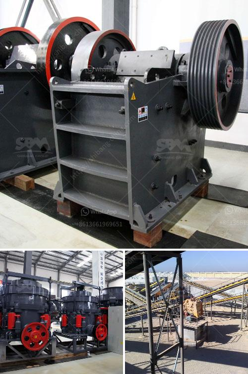

<h3>250tph comprehensive portable crushing plant</h3>
The demand for portable crushing plants is increasing with the need for rapid infrastructure development and the availability of suitable raw materials. One such highly efficient and versatile portable crushing plant is the 250tph comprehensive portable crushing plant.

The 250tph comprehensive portable crushing plant is designed with utmost precision and incorporates several features that enhance the overall performance of the plant. The plant consists of a primary jaw crusher, secondary cone crusher, and a tertiary vertical shaft impactor (VSI) crusher. With this combination, the plant can produce high-quality final products with excellent shape and uniformity.

The primary jaw crusher in the plant is responsible for reducing the large-sized rocks to smaller sizes suitable for further processing. It has a large feed opening and a high crushing capacity, ensuring that the plant can handle a wide range of materials. The jaw crusher is equipped with a hydraulic discharge setting adjustment system, allowing the operator to easily control the product size.

The secondary cone crusher in the plant further reduces the size of the material to produce finer and more uniform products. It has a high crushing efficiency and is capable of producing a wide range of end products. The cone crusher is equipped with an automatic hydraulic adjustment system, ensuring optimal performance and minimal downtime.

The tertiary VSI crusher in the plant is responsible for producing high-quality sand and aggregate materials. It utilizes the rock-on-rock principle, where rocks are crushed by impact with each other. This results in superior shape and quality of the final products. The VSI crusher is also equipped with a hydraulic lifting system, making it easy to maintain and operate.

The 250tph comprehensive portable crushing plant also features a heavy-duty vibrating grizzly feeder, which ensures a constant and controlled feed to the primary jaw crusher. This eliminates any potential bottlenecks in the crushing process and improves overall plant efficiency.

Another noteworthy feature of this portable crushing plant is its mobility. The plant is mounted on a wheeled chassis, allowing it to be easily transported from one location to another. This makes it ideal for contractors and quarry operators who need to move the plant frequently, depending on the project requirements.

In conclusion, the 250tph comprehensive portable crushing plant is a highly efficient and versatile solution for crushing and screening applications. With its advanced features and mobility, it offers contractors and quarry operators the ability to produce high-quality final products in a cost-effective manner. Whether it is for road construction, concrete production, or any other application, this portable crushing plant is a reliable and efficient choice.
<h3>Contact us</h3><ul><li><strong>Whatsapp:&nbsp;<a href="https://wa.me/8613661969651">+8613661969651</a></strong></li><li><a href="https://swt.shibang-china.com/?git&amp;zhl&amp;250tph comprehensive portable crushing plant"><strong>Online Service(chat now)</strong></a></li></ul><h3>Related</h3><ul><li><a href='impact crusher seller.md'>impact crusher seller</a></li><li><a href='iron crusher in mexico.md'>iron crusher in mexico</a></li><li><a href='clay processing techniques.md'>clay processing techniques</a></li><li><a href='complete gold mining equipment for small scale mines.md'>complete gold mining equipment for small scale mines</a></li><li><a href='japan crushing machine manufacturers list.md'>japan crushing machine manufacturers list</a></li></ul>