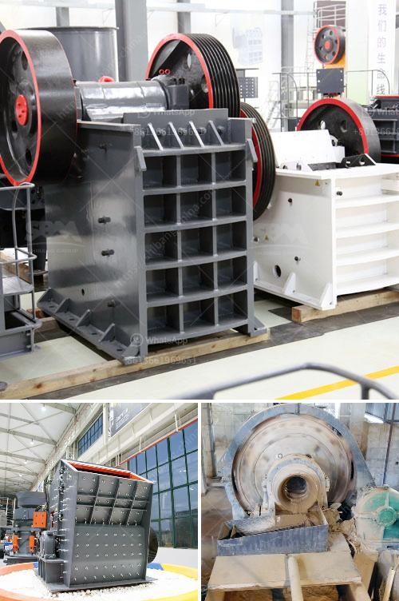

<h3>3 roller mill manufacturers in india</h3>
India is a thriving nation that is blessed with a rich heritage and a vibrant culture. It is also home to numerous industries, including the manufacturing sector. One of the key industries in India is the milling industry, which plays a crucial role in the country's economy. In this article, we will explore three prominent roller mill manufacturers in India.

Bühler India is a subsidiary of the Bühler group, which is a leading global technology provider for the food processing industry. The company was established in 1992 and is headquartered in Bengaluru. Bühler India offers a wide range of innovative milling solutions, including roller mills, grain cleaning equipment, and process automation systems.

Bühler India's roller mills are known for their robust construction and excellent performance. They are designed to handle a wide variety of grains, such as wheat, maize, rice, and pulses. The company's roller mills are equipped with advanced features, such as automatic feeding and control systems, ensuring maximum efficiency and productivity.

RMS Roller Grinder is a renowned roller mill manufacturer that has been in operation for over 25 years. The company is based in Tea, South Dakota, USA, but has a strong presence in the Indian market. RMS Roller Grinder offers state-of-the-art roller mill solutions that are used by thousands of customers worldwide.

The company's roller mills are known for their durability, precision, and high performance. They are designed to produce consistent particle size distributions, ensuring optimal extraction rates and nutrient preservation. RMS Roller Grinder's roller mills are customizable and can be tailored to meet the specific needs of each customer.

Frigmaires Engineers is a leading manufacturer and exporter of roller mills and other processing equipment. The company was established in 1961 and is headquartered in Mumbai. Frigmaires Engineers offers a wide range of roller mills, including triple roller mills, bead mills, and horizontal roller mills.

The company's roller mills are known for their versatility and efficiency. They are designed to handle different types of materials, such as paints, inks, pigments, and adhesives. Frigmaires Engineers' roller mills are equipped with advanced cooling systems, ensuring optimal temperature control during the milling process.

In conclusion, the milling industry in India is witnessing significant growth, and roller mills are an essential component of this industry. Bühler India, RMS Roller Grinder, and Frigmaires Engineers are three notable roller mill manufacturers that offer innovative milling solutions. These companies have established themselves as leaders in the field by delivering high-quality products that meet the diverse needs of their customers. With their extensive experience and technical expertise, they continue to contribute to the growth and success of the Indian milling industry.
<h3>Contact us</h3><ul><li><strong>Whatsapp:&nbsp;<a href="https://wa.me/8613661969651">+8613661969651</a></strong></li><li><a href="https://swt.shibang-china.com/?git&amp;zhl&amp;3 roller mill manufacturers in india"><strong>Online Service(chat now)</strong></a></li></ul><h3>Related</h3><ul><li><a href='suppliers of ball mill in bhopal.md'>suppliers of ball mill in bhopal</a></li><li><a href='clay aggregate machinery product.md'>clay aggregate machinery product</a></li><li><a href='consol glass cullet price per ton south africa.md'>consol glass cullet price per ton south africa</a></li><li><a href='gypsum crushing machine price.md'>gypsum crushing machine price</a></li><li><a href='american cone crushers.md'>american cone crushers</a></li></ul>