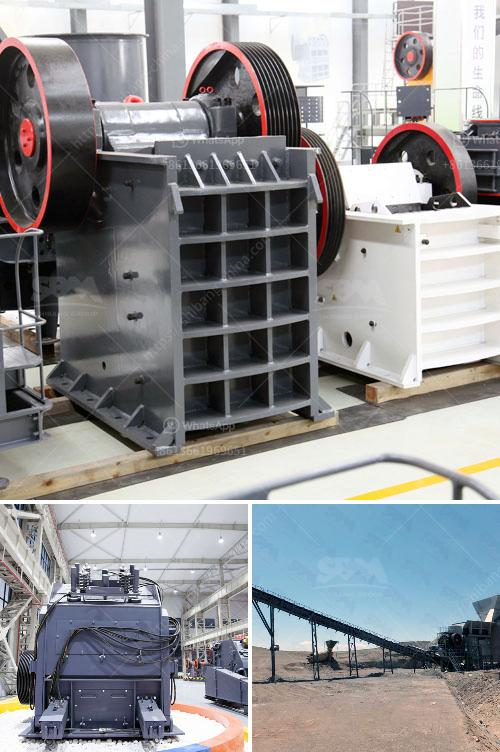

<h3>300 tons per hour mobile crawler crusher price</h3>
The demand for mobile crushers is steadily increasing as the need to move construction materials from one site to another becomes crucial. Mobile crushers offer flexibility and convenience, as they can be easily transported to different locations. One such mobile crusher that has caught the attention of the industry is the 300 tons per hour mobile crawler crusher.

As the name suggests, the machine is mounted on a tracked undercarriage. It offers impressive mobility and maneuverability, allowing contractors to crush materials on-site, eliminating the need to transport them to a fixed crushing plant. This not only saves time but also reduces transportation costs, making it an attractive solution for various construction projects.

The 300 tons per hour mobile crawler crusher features a powerful jaw crusher that can break down even the toughest and most abrasive materials. It operates at a high output rate of up to 300 tons per hour. The machine is designed for ease of mobility, featuring a quick set-up time and a straightforward control panel. It is equipped with a remote control system, allowing operators to easily adjust the crusher settings without having to leave the cab of the machine.

One of the key benefits of the 300 tons per hour mobile crawler crusher is its fuel efficiency. The machine is equipped with a highly efficient diesel engine that consumes less fuel per hour compared to similar machines in its class. This not only helps to reduce operating costs but also lowers emissions, making it an environmentally friendly choice.

When it comes to pricing, the 300 tons per hour mobile crawler crusher is competitively priced in the market. Factors such as the machine's features, performance, and long-term reliability contribute to its overall value. Additionally, the cost of maintenance and spare parts is relatively low, further enhancing its affordability. However, it is important to consider that the actual price may vary depending on factors such as location, supplier, and additional features or modifications.

In conclusion, the 300 tons per hour mobile crawler crusher is an efficient and cost-effective solution for crushing and recycling materials on construction sites. With its mobility and compact design, it offers great flexibility, allowing contractors to move quickly between projects. Its powerful jaw crusher, along with its fuel efficiency, makes it a reliable choice for a wide range of applications. Whether it's crushing concrete, asphalt, or other construction materials, this mobile crusher delivers exceptional performance. If you're in the market for a mobile crusher, the 300 tons per hour mobile crawler crusher is certainly worth considering.
<h3>Contact us</h3><ul><li><strong>Whatsapp:&nbsp;<a href="https://wa.me/8613661969651">+8613661969651</a></strong></li><li><a href="https://swt.shibang-china.com/?git&amp;zhl&amp;300 tons per hour mobile crawler crusher price"><strong>Online Service(chat now)</strong></a></li></ul><h3>Related</h3><ul><li><a href='crushing aggregates philippines.md'>crushing aggregates philippines</a></li><li><a href='mini cement plant capacity of ton per day.md'>mini cement plant capacity of ton per day</a></li><li><a href='vsi5x crusher for sale.md'>vsi5x crusher for sale</a></li><li><a href='ball mill grinder canada.md'>ball mill grinder canada</a></li><li><a href='small mobile rock pulverizer.md'>small mobile rock pulverizer</a></li></ul>