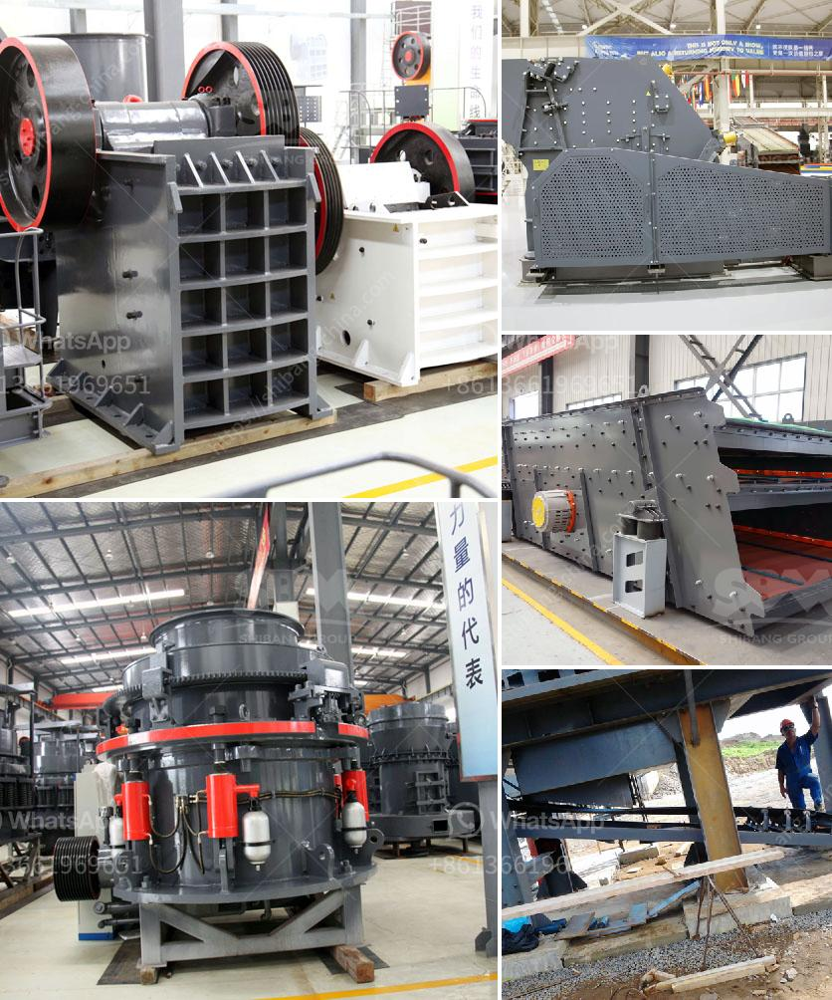

<h3>50 tpd cement plant cost in india</h3>
India is the second-largest producer of cement in the world, making it an important player in the global cement industry. Over the years, the demand for cement has increased significantly, leading to the establishment of numerous cement plants across the country. One type of cement plant that has gained popularity in recent years is the 50 TPD cement plant.

A 50 TPD (ton per day) cement plant is a relatively small cement plant with a capacity of 50 tons per day. This type of cement plant is suitable for small-scale cement production, targeting markets where demand is limited. However, it is still important to carefully assess the market conditions before setting up such a plant.

The cost of a 50 TPD cement plant in India can vary depending on several factors. Some of these factors are highlighted below:

1. Location: The location of the cement plant plays a crucial role in determining its cost. Factors such as transportation costs, availability of raw materials, and proximity to the target market can significantly influence the overall cost.

2. Technology and equipment: The type of technology and equipment used in the cement plant also impacts the cost. Advanced technology and modern equipment may require a higher investment, but they can lead to increased efficiency and productivity in the long run.

3. Land and infrastructure: The cost of acquiring land and developing infrastructure for the cement plant should be considered. The availability and cost of utilities such as water and electricity are important factors to ensure a smooth operation of the plant.

4. Environmental regulations: Compliance with environmental regulations may lead to additional costs. Implementing measures to reduce pollution and ensure sustainable practices in cement production can add to the overall cost.

5. Labour and operational costs: The cost of labour and operational expenses, including maintenance and repairs, should be taken into account. In India, labour costs are relatively low compared to other countries, which can be advantageous for setting up a cement plant.

Based on these factors, the estimated cost of a 50 TPD cement plant in India can range from $1.5 million to $2.5 million. However, it is essential to conduct a detailed feasibility study and consider the specific requirements of the project to ascertain the accurate cost.

In conclusion, the cost of setting up a 50 TPD cement plant in India can vary depending on multiple factors. While this type of cement plant is suitable for small-scale production, careful consideration of market conditions, technology, infrastructure, and environmental regulations is necessary to ensure a successful and cost-effective venture.
<h3>Contact us</h3><ul><li><strong>Whatsapp:&nbsp;<a href="https://wa.me/8613661969651">+8613661969651</a></strong></li><li><a href="https://swt.shibang-china.com/?git&amp;zhl&amp;50 tpd cement plant cost in india"><strong>Online Service(chat now)</strong></a></li></ul><h3>Related</h3><ul><li><a href='powder grinding mill price.md'>powder grinding mill price</a></li><li><a href='coal drying plant manufacturers in china.md'>coal drying plant manufacturers in china</a></li><li><a href='crusher in sale in nepal.md'>crusher in sale in nepal</a></li><li><a href='crusher suppliers in kenya.md'>crusher suppliers in kenya</a></li><li><a href='grinding mill prices in zimbabwe.md'>grinding mill prices in zimbabwe</a></li></ul>