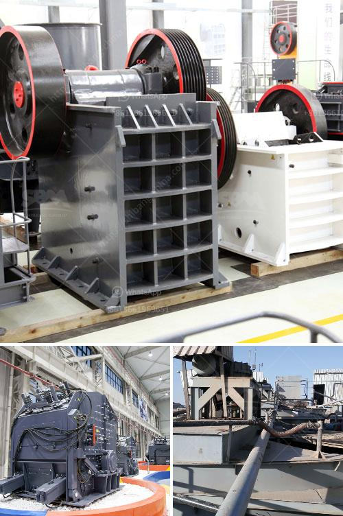

<h3>500 tph jaw crusher for sale</h3>
The crusher industry has been continuously expanding in recent years, with the development of many infrastructure projects, such as roads, bridges, highways, railways, airports and so on. As a result, there is a huge demand for crushers of all kinds, including jaw crushers.

Jaw crushers are one of the most commonly preferred crushers due to their ability to crush all kinds of materials of any hardness, as well as their low-cost operation and easy maintenance. One of the key factors driving this demand is the versatility and efficiency of the jaw crushers available in the market.

One such highly efficient jaw crusher is the 500 TPH Jaw Crusher. With a capacity of 50-500 tons per hour, this robust crusher has been designed specifically for heavy-duty mining operations. The 500 TPH Jaw crusher is powered by a highly efficient powerplant engine that helps optimize fuel costs and emissions.

The crusher comes with heavy-duty fabricated steel frame and a moving jaw, both of which are powered by a robust 500 horsepower electric motor. The crusher can crush materials of any hardness, making it ideal for a wide range of applications. These include limestone, granite, basalt, and even concrete and asphalt for recycling purposes.

The design of the 500 TPH Jaw crusher ensures high crushing reduction ratio and capacity. With its deep crushing chamber, adjustable close side setting and large feed opening, the crusher can handle even the toughest of materials, resulting in high-quality end products. The crusher's hydraulic system enables easy adjustment of the CSS (closed side setting) for precise control over the product size.

In addition to its high productivity, the 500 TPH Jaw crusher offers excellent operational safety features. The crusher is equipped with a hydraulic release system, which allows for the quick and safe removal of any uncrushable materials. The crusher also has an advanced overload protection system that automatically protects the crusher from damage in case of overloading.

The 500 TPH Jaw crusher is also easy to operate and maintain, with user-friendly controls, simple daily maintenance and a wide range of optional equipment available for customization. Whether it's quick setup, mobility, or enhanced performance, this jaw crusher has it all.

Overall, the 500 TPH Jaw crusher is a highly versatile and efficient jaw crusher that offers great value for money. It is ideal for customers looking for high productivity, low operating costs, and easy maintenance. With its powerful engine, heavy-duty construction, and advanced features, this jaw crusher is definitely worth considering for any mining or quarrying application.

In conclusion, the 500 TPH Jaw crusher is a reliable and efficient crusher that offers superior performance and value for money. Its robust construction and powerful engine ensure high productivity and low operating costs, while its user-friendly design and advanced features make it easy to operate and maintain. If you are in the market for a jaw crusher, the 500 TPH Jaw crusher should definitely be on your list.
<h3>Contact us</h3><ul><li><strong>Whatsapp:&nbsp;<a href="https://wa.me/8613661969651">+8613661969651</a></strong></li><li><a href="https://swt.shibang-china.com/?git&amp;zhl&amp;500 tph jaw crusher for sale"><strong>Online Service(chat now)</strong></a></li></ul><h3>Related</h3><ul><li><a href='harga mesin sekunder stone crusher bekas.md'>harga mesin sekunder stone crusher bekas</a></li><li><a href='stone crushing contractors california.md'>stone crushing contractors california</a></li><li><a href='materials for conveyor belts in nigeria.md'>materials for conveyor belts in nigeria</a></li><li><a href='hp cone crusher.md'>hp cone crusher</a></li><li><a href='low cost jaw crusher price.md'>low cost jaw crusher price</a></li></ul>