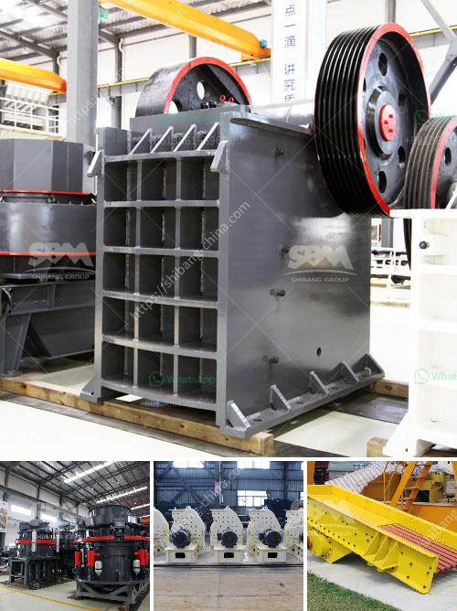

<h3>500 tph stone crusher price</h3>
In recent years, due to the continuous development of infrastructure and urbanization construction, more and more construction waste has been generated. This has led to an increase in demand for equipment such as stone crushers that can help process this waste into useful resources. As a result, the market for stone crushers has experienced a surge in demand.

When looking at the current stone crushers market, one can see that it is filled with various brands and models. However, one particular machine that has been gaining popularity in the market is the 500 tph stone crusher. With this machine, it is possible to process large stones with high efficiency.

The 500 tph stone crusher is highly popular for its large crushing capacity. In the quarrying and mining industry, the machine is often used for primary crushing of large stones. It can crush materials with compressive strength of up to 350 MPa, making it an ideal choice for the first stage of crushing.

Another key feature of the 500 tph stone crusher is its high production capacity. On average, the machine can crush up to 600 tons of stones per hour. This means that it can be used to produce a large quantity of stones in a relatively short period of time, improving the efficiency of any construction project.

When it comes to pricing, the 500 tph stone crusher is generally considered to be on the higher end of the market. The exact price can vary depending on the specific model and features of the machine. However, it is important to note that investing in a high-quality stone crusher can greatly benefit construction companies in the long run.

By investing in a 500 tph stone crusher, construction companies can reduce their reliance on external suppliers for aggregate materials. This can help save costs and improve the efficiency of construction projects. Additionally, the machine's high production capacity means that companies can complete their projects faster, allowing them to take on more projects and generate higher revenue.

In conclusion, the 500 tph stone crusher is a great investment choice for a construction company. Its high crushing capacity and production efficiency can help companies save costs and improve the overall efficiency of their projects. While the initial price may be higher, the long-term benefits make it a worthwhile investment.
<h3>Contact us</h3><ul><li><strong>Whatsapp:&nbsp;<a href="https://wa.me/8613661969651">+8613661969651</a></strong></li><li><a href="https://swt.shibang-china.com/?git&amp;zhl&amp;500 tph stone crusher price"><strong>Online Service(chat now)</strong></a></li></ul><h3>Related</h3><ul><li><a href='vertical spindle roller mill.md'>vertical spindle roller mill</a></li><li><a href='gold washing machine from rock.md'>gold washing machine from rock</a></li><li><a href='specification of a ball mill.md'>specification of a ball mill</a></li><li><a href='jaw crusher plates supplier philippines.md'>jaw crusher plates supplier philippines</a></li><li><a href='harga vibrating screen.md'>harga vibrating screen</a></li></ul>