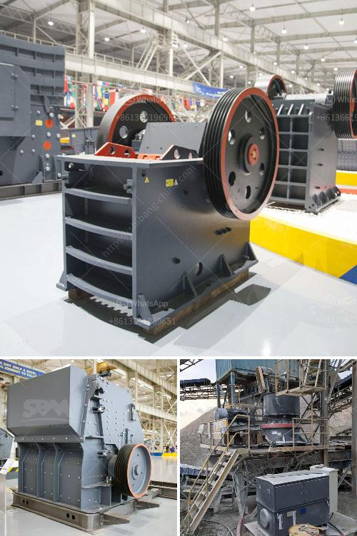

<h3>500mm vertical mill stones price</h3>
Vertical mill stones play a crucial role in various industries, especially in the milling and grinding processes. Typically used in flour mills and other grinding applications, these stones are responsible for converting raw materials into fine powder or desired consistency. Among the many options available in the market, 500mm vertical mill stones are highly sought after due to their size and efficiency. In this article, we will explore the price range and factors that influence the cost of these mill stones.

Vertical mill stones are available in different sizes, with 500mm being a commonly chosen dimension. The size of the mill stones directly affects their capability to handle large quantities of material efficiently. Larger stones provide a greater surface area for grinding, which ultimately results in faster production rates. However, the larger the stones, the higher the price, so mill owners must strike a balance between capacity needs and budget constraints.

The quality of the mill stones plays a pivotal role in determining their price. Mill owners often prefer stones made from natural materials like granite, basalt, or sandstone due to their superior strength and longevity. These stones offer excellent resistance to wear and tear, ensuring prolonged operational life. Stones made from synthetic materials may come at a lower price, but they often compromise on durability and efficiency, making them a less favorable choice in the long run.

The intricacy and precision involved in manufacturing mill stones significantly influence their price range. Advanced manufacturing techniques, such as computer numerical control (CNC) machinery, can produce mill stones with exceptional accuracy, resulting in enhanced grinding performance. Stones manufactured with higher precision tend to command a higher price due to the increased investment required in specialized machinery and skilled labor.

The reputation of the supplier can also impact the price of 500mm vertical mill stones. Reputable suppliers often provide stones that are meticulously crafted, offering consistent grain size distribution and reliable performance, which can justify higher prices. Additionally, market competition can lead to price variations, with suppliers offering competitive pricing structures and discounts to attract customers. It's essential to research and compare prices from multiple suppliers to ensure a fair market value.

If your milling requirements demand unique specifications or additional features, such as special coating for anti-corrosion purposes or custom-made attachment points, these factors may increase the overall price of the mill stones. Customization options catered to specific needs often come at an extra cost, but they can greatly enhance productivity and efficiency in the long term.

When considering the price of 500mm vertical mill stones, it's crucial to evaluate the size, quality, manufacturing precision, supplier reputation, and any additional customization requirements. While budgetary considerations are important, it is equally essential to prioritize factors such as durability, efficiency, and long-term cost-effectiveness. By understanding these factors, buyers can make informed decisions and find the best value for their investment in vertical mill stones.
<h3>Contact us</h3><ul><li><strong>Whatsapp:&nbsp;<a href="https://wa.me/8613661969651">+8613661969651</a></strong></li><li><a href="https://swt.shibang-china.com/?git&amp;zhl&amp;500mm vertical mill stones price"><strong>Online Service(chat now)</strong></a></li></ul><h3>Related</h3><ul><li><a href='calcium carbide manufacturing plant.md'>calcium carbide manufacturing plant</a></li><li><a href='mobile stone crusher price ph.md'>mobile stone crusher price ph</a></li><li><a href='business plan for small scale gold processing plant.md'>business plan for small scale gold processing plant</a></li><li><a href='sand wash plant for sale in india.md'>sand wash plant for sale in india</a></li><li><a href='estimate cost simple stone crusher plant.md'>estimate cost simple stone crusher plant</a></li></ul>