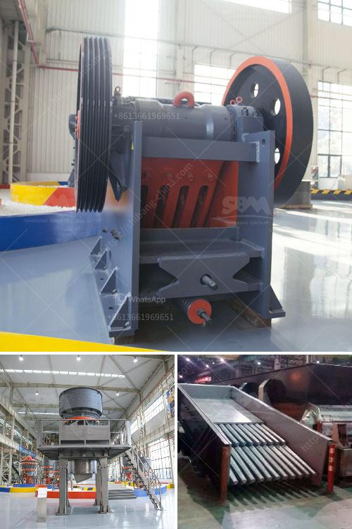

<h3>7 in x 8 in hammer mill gold quarz</h3>
A hammer mill is an indispensable tool in the mining industry, particularly for the production of valuable gold quartz ore. With its robust construction, high-speed rotating blades, and a screen encompassing the grinding chamber, this mechanical apparatus is used to reduce bulk materials into smaller particles. In this article, we will explore the features and benefits of a 7 x 8-inch gold quartz hammer mill, highlighting its capabilities and its contribution to efficient gold extraction.

The 7 x 8-inch gold quartz hammer mill is adept at crushing various materials, including gold quartz ore, to finer particles within seconds. Its rotating blades, powered by electricity or diesel engines, deliver high-speed impacts, reducing bulky rocks into a manageable size. This not only simplifies the extraction process but also ensures a higher gold recovery rate by increasing the surface area of ores exposed to subsequent processing.

The gold quartz hammer mill's unique design incorporates a heavy-duty steel frame, which ensures the machine's longevity even in the harshest mining environments. The durable construction minimizes wear and tear, ultimately lowering maintenance costs and ensuring uninterrupted production. With their sturdiness, these machines are capable of handling large quantities of ore, making them an ideal choice for high-capacity processing operations.

The gold quartz hammer mill offers versatility in the size range of the output particles. The fitted screens can be easily interchanged, allowing operators to adjust the mill's settings to achieve the desired final product granularity. Whether the goal is to reduce larger rocks to a consistent sand-like texture or achieve finer powdered material, this flexibility ensures the hammer mill can cater to various processing needs.

Investing in a 7 x 8-inch gold quartz hammer mill can significantly impact the economics of gold mining operations. Its cost-effectiveness lies in its ability to process large volumes of material in a relatively short period, resulting in higher production rates and reduced operational costs. Additionally, the machine's durability and low maintenance requirements contribute to long-term cost savings.

The use of a hammer mill for gold quartz processing aligns with an environmentally sustainable approach to mining. By swiftly reducing the size of bulky rocks, this technology minimizes the need for excessive energy consumption associated with traditional crushing methods. With the increased efficiency, mining operations can reduce their carbon footprint and contribute positively to the global environment.

In the mining industry, the 7 x 8-inch gold quartz hammer mill is a groundbreaking innovation that revolutionizes the extraction process. Its ability to crush and reduce gold quartz ore into finer particles efficiently has a significant impact on gold recovery rates. With robust construction, versatility in particle size reduction, and cost-effective features, this hammer mill has become a valuable asset for mining operations worldwide. Investing in this technology not only enhances productivity but also ensures a more sustainable and environmentally friendly approach to mining gold quartz.
<h3>Contact us</h3><ul><li><strong>Whatsapp:&nbsp;<a href="https://wa.me/8613661969651">+8613661969651</a></strong></li><li><a href="https://swt.shibang-china.com/?git&amp;zhl&amp;7 in x 8 in hammer mill gold quarz"><strong>Online Service(chat now)</strong></a></li></ul><h3>Related</h3><ul><li><a href='basalt processing machine.md'>basalt processing machine</a></li><li><a href='stone crush rate in islamabad.md'>stone crush rate in islamabad</a></li><li><a href='buy impact crushers.md'>buy impact crushers</a></li><li><a href='used raymond mill for sale in taiwan crusher.md'>used raymond mill for sale in taiwan crusher</a></li><li><a href='portable stone crusher for sale.md'>portable stone crusher for sale</a></li></ul>