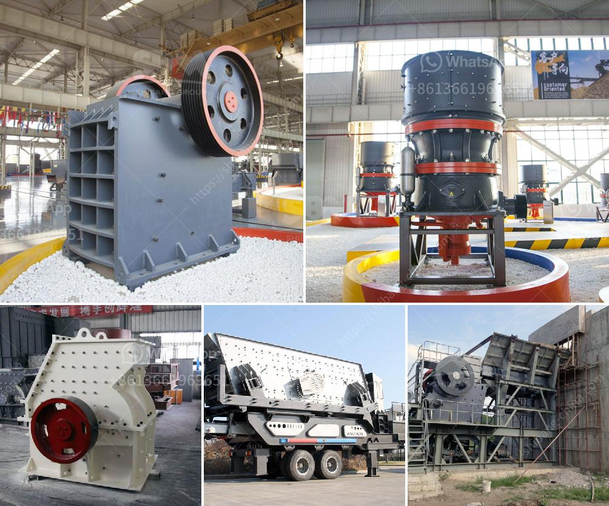

<h3>about aggregate crushing comoany in ethiopia</h3>
Ethiopia is one of the fastest-growing economies in Africa, with a population of over 112 million people. As the country continues to develop and urbanize, the demand for construction materials is skyrocketing. In order to keep up with this demand, the aggregate crushing industry is playing a crucial role in Ethiopia's infrastructure development.

One of the leading companies in this industry is XYZ Aggregate Crushing Company. Founded in 2017, the company has experienced steady growth and has quickly become a reliable and reputable provider of aggregates in Ethiopia. With a strong commitment to quality and customer satisfaction, XYZ Aggregate Crushing Company has established itself as a leading player in the market.

One of the key factors contributing to the success of XYZ Aggregate Crushing Company is its state-of-the-art crushing plant. With a capacity of 200-300 tons per hour, the plant can produce a wide range of high-quality aggregates that meet all applicable specifications. The company uses modern crushing equipment from renowned manufacturers such as Sandvik, Metso, and Powerscreen to ensure consistent and reliable product quality.

Moreover, XYZ Aggregate Crushing Company is dedicated to sustainable practices. The company follows strict environmental regulations and employs various measures to minimize its carbon footprint. For example, the plant is equipped with dust suppression systems and a closed-loop water treatment system to prevent environmental contamination. Additionally, the company actively participates in reforestation projects and promotes the use of recycled concrete and asphalt in construction projects.

In terms of market reach, XYZ Aggregate Crushing Company has a vast customer base. The company supplies aggregates to various construction projects, including building roads, bridges, and residential complexes. It also caters to government projects, providing aggregates that meet stringent specifications and quality standards. In addition to serving the domestic market, the company also exports its products to neighboring countries, contributing to the economic growth of the region.

To ensure the high-quality standards of its products, XYZ Aggregate Crushing Company invests heavily in its workforce. The company employs skilled professionals who undergo regular training to keep up with industry trends and modern techniques. From crushing plant operators to quality control technicians, XYZ Aggregate Crushing Company values the expertise and dedication of its employees, as they play a crucial role in meeting customer expectations.

Looking ahead, XYZ Aggregate Crushing Company is committed to continuous improvement and expansion. The company aims to further increase its production capacity to meet the ever-growing demand for aggregates in Ethiopia. It also plans to explore new markets and diversify its product offerings to cater to a wider range of customers. With a strong foundation and a customer-centric approach, XYZ Aggregate Crushing Company is well-positioned to remain a key player in the Ethiopian construction industry for years to come.

In conclusion, Ethiopia's aggregate crushing industry is witnessing significant growth, driven by the country's rapid urbanization and infrastructure development. Companies like XYZ Aggregate Crushing Company are playing a crucial role in meeting the demand for high-quality aggregates. With their modern crushing equipment, commitment to sustainability, and dedicated workforce, these companies are propelling Ethiopia's construction sector forward while ensuring the long-term prosperity of the nation.
<h3>Contact us</h3><ul><li><strong>Whatsapp:&nbsp;<a href="https://wa.me/8613661969651">+8613661969651</a></strong></li><li><a href="https://swt.shibang-china.com/?git&amp;zhl&amp;about aggregate crushing comoany in ethiopia"><strong>Online Service(chat now)</strong></a></li></ul><h3>Related</h3><ul><li><a href='quarry crusher machine.md'>quarry crusher machine</a></li><li><a href='small sand washing machine.md'>small sand washing machine</a></li><li><a href='rock crushers for sale south africa.md'>rock crushers for sale south africa</a></li><li><a href='crushing asphalt with jaw crusher.md'>crushing asphalt with jaw crusher</a></li><li><a href='cost of graphite processing plant.md'>cost of graphite processing plant</a></li></ul>