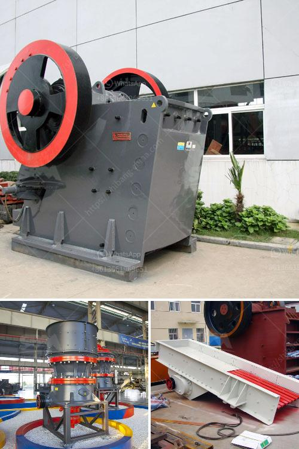

<h3>aggregate concrete plant</h3>
Concrete has been the cornerstone of construction for centuries. From ancient Roman structures to modern skyscrapers, this durable material has always played a vital role in building projects. However, the process of making concrete has seen significant advancements, the latest being the introduction of aggregate concrete plants.

An aggregate concrete plant is a facility that combines various materials such as sand, gravel, cement, and water to create concrete in large quantities. These plants are designed to provide ready-mix concrete for construction projects, eliminating the need for manual mixing on-site. With their ability to produce specific concrete mixes on-demand, aggregate concrete plants have revolutionized the construction industry.

One of the key advantages of aggregate concrete plants is their efficiency. By having all the necessary materials readily available, construction crews can focus solely on the task at hand. This eliminates the time-consuming process of manually measuring and mixing concrete components on-site. Additionally, aggregate concrete plants ensure consistent quality as the mixing ratios are controlled automatically, resulting in a superior end product.

Moreover, aggregate concrete plants enhance productivity by expediting the construction timeline. With concrete conveniently available on-site, construction teams can operate with minimal downtime, reducing the overall project duration. This is particularly beneficial for time-sensitive projects such as road construction, where delays can cause disruptions to traffic flow and increase costs.

Another crucial advantage of aggregate concrete plants is their environmental sustainability. These plants utilize advanced systems for capturing dust particles, minimizing pollution during the production process. Additionally, aggregate concrete plants can recycle leftover materials, reducing waste and saving resources. By adopting such plants, construction companies can contribute to a greener future while meeting project requirements.

Furthermore, aggregate concrete plants contribute to cost savings. By eliminating the need for manual concrete mixing, labor costs are significantly reduced. Additionally, these plants enhance the efficient use of raw materials, leading to cost savings in the long run. With their precise measuring systems, aggregate concrete plants ensure minimal material waste, making every ounce count.

The versatility offered by aggregate concrete plants is another major advantage. These plants can produce numerous concrete mixes tailored to specific project requirements, including high-strength concretes for heavy structures or lightweight concretes for insulation purposes. This adaptability allows construction professionals to meet the diverse demands of different projects without compromising quality.

In conclusion, aggregate concrete plants have transformed the construction industry by streamlining the process of concrete production. Their ability to provide ready-mix concrete on-demand, eliminate manual mixing, enhance efficiency, promote sustainability, and offer cost savings make them indispensable in modern construction projects. As the demand for new infrastructure continues to rise, aggregate concrete plants will undoubtedly play a crucial role in meeting the needs of a rapidly evolving world. With their revolutionary capabilities, these plants have cemented their place as true game-changers in the construction sector.
<h3>Contact us</h3><ul><li><strong>Whatsapp:&nbsp;<a href="https://wa.me/8613661969651">+8613661969651</a></strong></li><li><a href="https://swt.shibang-china.com/?git&amp;zhl&amp;aggregate concrete plant"><strong>Online Service(chat now)</strong></a></li></ul><h3>Related</h3><ul><li><a href='talc grinding mill plants.md'>talc grinding mill plants</a></li><li><a href='limestone ball mill machine.md'>limestone ball mill machine</a></li><li><a href='small stone brick crusher.md'>small stone brick crusher</a></li><li><a href='price of crushed stone in ethiopia.md'>price of crushed stone in ethiopia</a></li><li><a href='ball mill in zimbabwe.md'>ball mill in zimbabwe</a></li></ul>