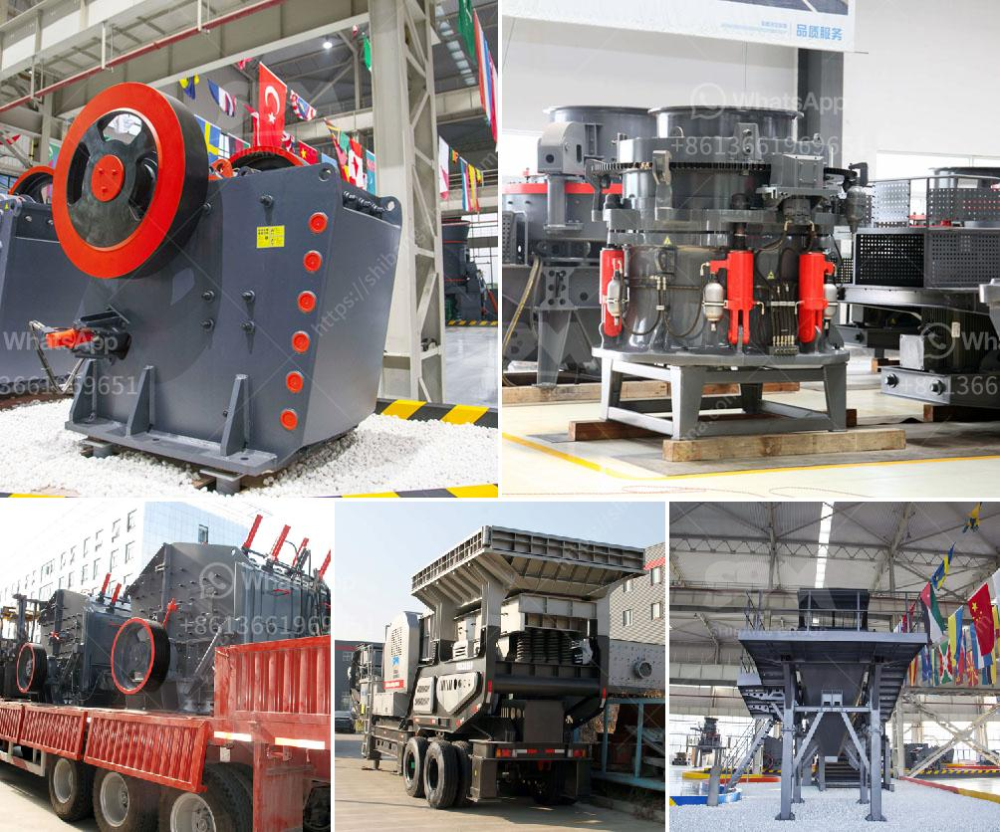

<h3>aggregate crusher equipment</h3>
Crushing equipment is a key component in the production of aggregate materials. It is a crucial factor in deciding the final particle size and shape that the product will have. It significantly impacts the quality of the materials produced. With the advancement in technology and increase in demand for high-quality aggregate materials, the need for efficient and reliable crushing equipment has become even more significant.

One of the primary types of equipment used in the aggregate industry is the crusher machine. It allows for the reduction of larger-sized materials into smaller, more manageable pieces. These machines are ideal for producing a variety of aggregate materials, including crushed stone, sand, and gravel.

One of the most popular crusher types is the jaw crusher. It is commonly used for primary crushing purposes, as it allows for large feed opening sizes and high reduction ratios. The jaw crusher operates by crushing the material between two plates, one stationary and one movable. This action creates a compression force, breaking the material into smaller pieces.

Another commonly used crusher is the impact crusher. Unlike the jaw crusher, the impact crusher uses a blow bar to strike the material and force it against a stationary plate. This impact creates a higher reduction ratio and produces finer aggregate materials. Impact crushers are often used for secondary or tertiary crushing applications.

Cone crushers are also prevalent in the aggregate industry. They operate by compressing the material between a mantel and a concave, creating a continuous crushing action. Cone crushers are known for their ability to produce a more cubical-shaped end product and for their reliability in harsh environments.

Choosing the right crusher equipment depends on various factors, including the material's hardness, abrasiveness, and desired end product. Additionally, the size and volume of the defined aggregate need to be considered when selecting the appropriate machinery.

Moreover, advancements in crusher technology have led to the development of more efficient and reliable equipment. For example, some modern crushers are equipped with hydraulic systems that allow for easy adjustment of the crusher settings. This feature is especially valuable when dealing with different types of materials or variations in the feed size.

In recent years, there has been a growing demand for mobile crushing equipment in the aggregate industry. Mobile crushers offer several advantages, including increased flexibility, lower transportation costs, and the ability to work in various locations. They are ideal for on-site crushing and can easily be moved from one site to another.

In conclusion, crusher equipment plays a significant role in the production of high-quality aggregate materials. Whether it is a jaw crusher, impact crusher, or cone crusher, each type offers its unique advantages. The selection of the right equipment depends on factors such as material characteristics and the desired end product. With advancements in technology, the industry has witnessed the development of more efficient and versatile crushers. Mobile crushing equipment has also gained popularity due to its flexibility and cost-effectiveness. As the demand for superior aggregate materials continues to grow, the role of crusher equipment remains crucial in meeting market requirements.
<h3>Contact us</h3><ul><li><strong>Whatsapp:&nbsp;<a href="https://wa.me/8613661969651">+8613661969651</a></strong></li><li><a href="https://swt.shibang-china.com/?git&amp;zhl&amp;aggregate crusher equipment"><strong>Online Service(chat now)</strong></a></li></ul><h3>Related</h3><ul><li><a href='hydraulic cone crusher.md'>hydraulic cone crusher</a></li><li><a href='stone crush rate in islamabad.md'>stone crush rate in islamabad</a></li><li><a href='granite processing equipment for sale nigeria.md'>granite processing equipment for sale nigeria</a></li><li><a href='hammer mill mesin impor china.md'>hammer mill mesin impor china</a></li><li><a href='manufacturer of balls of ball mill in india.md'>manufacturer of balls of ball mill in india</a></li></ul>