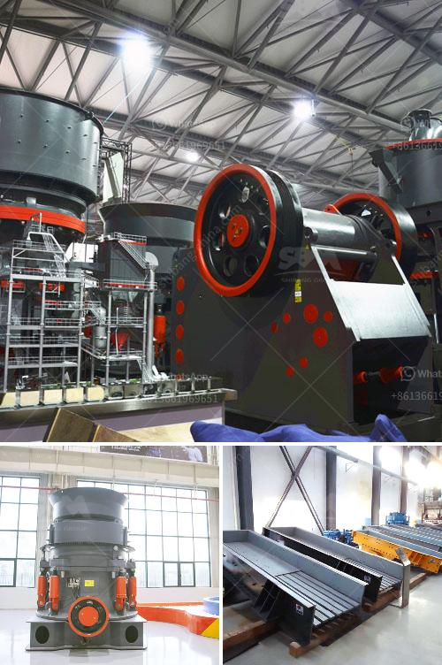

<h3>aggregate crusher supplier</h3>
When it comes to construction, the importance of aggregates cannot be understated. These materials play a crucial role in the strength and stability of any structure, whether it's a building, a road, or a bridge. That's why finding a reliable aggregate crusher supplier is essential for any construction project.

An aggregate crusher is a machine that crushes rocks and minerals to smaller pieces or gravel. They are used in a variety of industries, including construction, mining, and recycling. This machinery is usually found in quarries or mines, as the primary equipment for the production of aggregates.

Choosing the right aggregate crusher supplier is vital for the success of your project. Here are a few factors to consider when selecting a supplier:

1. Quality of Equipment: The quality of the aggregate crusher machines provided by the supplier is crucial. You need machines that are durable, reliable, and efficient. Look for suppliers who offer high-quality machinery from reputable manufacturers. This will ensure that your equipment will withstand the rugged environments often found in quarries and mines.

2. Range of Products: Different construction projects require different types of aggregates. Look for a supplier who can offer a wide range of products to meet your specific needs. Whether you are looking for coarse aggregate, fine aggregate, or specialty aggregates, the supplier should have the necessary equipment and resources to deliver what you require.

3. Cost Efficiency: Construction projects often have tight budgets, so it's essential to choose a supplier who can provide cost-effective solutions. Consider not only the initial cost of the equipment but also the long-term operating and maintenance costs. A reliable supplier will offer competitive pricing while delivering high-quality equipment.

4. After-Sales Service: Construction equipment is subject to wear and tear, so it's important to choose a supplier who offers excellent after-sales service. Look for a supplier who provides maintenance, spare parts, and technical support. Having a reliable support system can minimize downtime and ensure that your project runs smoothly.

5. Reputation and Experience: Find a supplier with a solid reputation and extensive experience in the industry. Look for reviews, testimonials, and references from other contractors who have worked with the supplier. A reputable supplier will have a track record of delivering quality equipment and satisfied customers.

Overall, finding the right aggregate crusher supplier is crucial for the success of any construction project. Take the time to research and compare different suppliers to ensure you choose the best one for your specific needs. Remember to consider factors such as equipment quality, product range, cost efficiency, after-sales service, and the supplier's reputation and experience.

By doing your due diligence and selecting the right supplier, you can ensure that you have reliable and efficient machinery to produce the high-quality aggregates needed for your construction project.
<h3>Contact us</h3><ul><li><strong>Whatsapp:&nbsp;<a href="https://wa.me/8613661969651">+8613661969651</a></strong></li><li><a href="https://swt.shibang-china.com/?git&amp;zhl&amp;aggregate crusher supplier"><strong>Online Service(chat now)</strong></a></li></ul><h3>Related</h3><ul><li><a href='300 tons per hour mobile crawler crusher price.md'>300 tons per hour mobile crawler crusher price</a></li><li><a href='cone crusher design guideline pdf.md'>cone crusher design guideline pdf</a></li><li><a href='gypsum board manufacturing process.md'>gypsum board manufacturing process</a></li><li><a href='cement making machinery for whole cement plant.md'>cement making machinery for whole cement plant</a></li><li><a href='machinery for talc manufacturing.md'>machinery for talc manufacturing</a></li></ul>