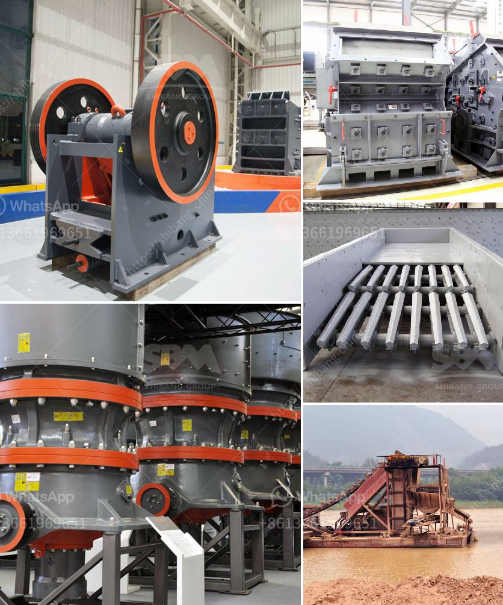

<h3>aggregate crushing contract in mexico</h3>
Mexico, known for its rich natural resources and rapidly growing construction sector, is witnessing a surge in the aggregate crushing contract industry. With a pressing need for construction materials and infrastructure development across the country, contractors are turning to specialized aggregate crushing services to meet the demand. This article explores the significance of aggregate crushing contracts in Mexico's construction sector and the benefits they bring to the industry.

Mexico's construction sector has experienced remarkable growth in recent years, mainly fueled by infrastructure projects, commercial developments, and residential construction. As a result, there has been an exponential increase in the demand for high-quality construction materials, such as aggregates.

Aggregates are vital components used in various construction applications, including concrete production, road construction, and building foundations. The ever-increasing need for aggregates has led to the emergence of aggregate crushing contracts, which focus on extracting, processing, and delivering aggregates for construction projects.

1. Cost and Time Efficiency: By outsourcing aggregate crushing to specialized contractors, construction companies can save significant costs associated with equipment, labor, and maintenance. Contractors, equipped with state-of-the-art machinery and experienced personnel, efficiently process aggregates, ensuring timely project completion.

2. Quality Control: Professional aggregate crushing contractors adhere to stringent quality control measures to deliver consistent and standardized aggregates. Their expertise in crushing techniques and knowledge of different aggregate specifications ensure the production of materials that meet industry standards. This ensures the overall quality and integrity of construction projects.

3. Environmental Considerations: Aggregate crushing contractors often integrate environmentally friendly practices into their operations. By minimizing waste generation, recycling materials, and implementing dust control measures, these contractors ensure compliance with environmental regulations and contribute to sustainable construction practices.

Mexico boasts several established aggregate crushing contractors, catering to the rapidly growing construction sector:

1. Grupo Constructor Pitic: With over 25 years of experience, Grupo Constructor Pitic offers comprehensive aggregate crushing services alongside a wide range of construction solutions across Mexico. Their commitment to quality and efficiency makes them a preferred choice among contractors.

2. Constroacero: Known for their cutting-edge technology and commitment to sustainable practices, Constroacero specializes in aggregate crushing services for large-scale infrastructure projects in Mexico. They consistently embrace innovation and strive to minimize the environmental impact of their operations.

Mexico's aggregate crushing contract industry has become an integral part of the country's construction sector, offering immense benefits to contractors and the overall development of the nation. By outsourcing aggregate crushing operations to specialized contractors, construction companies can ensure cost and time efficiency, maintain quality control, and contribute to sustainable construction practices. The expertise and professionalism of prominent aggregate crushing contractors in Mexico have positioned them as key players in meeting the country's growing demand for construction materials, thereby catalyzing infrastructure development and economic growth.
<h3>Contact us</h3><ul><li><strong>Whatsapp:&nbsp;<a href="https://wa.me/8613661969651">+8613661969651</a></strong></li><li><a href="https://swt.shibang-china.com/?git&amp;zhl&amp;aggregate crushing contract in mexico"><strong>Online Service(chat now)</strong></a></li></ul><h3>Related</h3><ul><li><a href='crusher product machine price south africa.md'>crusher product machine price south africa</a></li><li><a href='200tph vsi crushers.md'>200tph vsi crushers</a></li><li><a href='stone crusher in inda or parkistan.md'>stone crusher in inda or parkistan</a></li><li><a href='quote for china crusher.md'>quote for china crusher</a></li><li><a href='coal pulverizer crusher manufacturers in india.md'>coal pulverizer crusher manufacturers in india</a></li></ul>