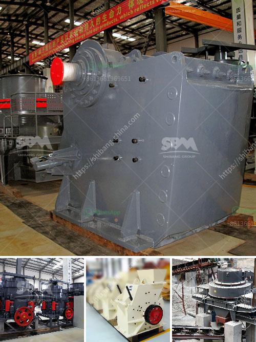

<h3>aggregate machine traders</h3>
In the realm of construction and infrastructure development, aggregate machines hold paramount importance. They are the backbone of a wide range of projects, from building roads, bridges, and dams to the construction of residential and commercial complexes. However, the process of acquiring and maintaining these heavy-duty machines can be time-consuming and costly for construction companies. This is where aggregate machine traders come into play, acting as indispensable intermediaries between the manufacturers and purchasers. In this article, we will explore the role and significance of aggregate machine traders.

Aggregate machine traders specialize in understanding the needs and requirements of construction projects. By working closely with manufacturers and suppliers, they curate a diverse pool of options for clients, ensuring they can find the ideal machine for their specific construction needs. This efficient sourcing of machinery saves construction companies precious time and resources that can be allocated to other critical areas of their projects.

Aggregate machine traders possess in-depth knowledge and expertise in the construction industry, particularly in the realm of machinery. They have a deep understanding of the technical aspects, functionalities, and capabilities of various aggregate machines. This places them in a prime position to provide valuable insights and advice to construction companies looking to make informed decisions regarding their machinery purchases. Such expert advice helps clients choose the right machine tailored to their requirements, thereby optimizing operational efficiency and minimizing unnecessary costs.

One of the significant advantages of working with aggregate machine traders is their ability to negotiate favorable prices due to their extensive network within the industry. By leveraging their relationships with manufacturers, bulk purchases, and industry know-how, aggregate machine traders can secure competitive pricing for their clients. This not only helps construction companies in obtaining machinery at lower costs but also enables them to maximize their return on investment. Additionally, traders often have access to a range of financing options, making the acquisition process more accessible and manageable for their clients.

Aggregate machine traders are committed to building long-term relationships with their clients. As such, they prioritize providing comprehensive after-sales support. This includes assistance with installation, training, and maintenance of the machinery. By facilitating access to reliable service centers and technical support, aggregate machine traders ensure that construction companies can maintain their equipment's optimal performance over time. Their dedicated customer service helps minimize downtime and operational disruptions, enhancing the overall efficiency and productivity of their clients' projects.

Aggregate machine traders play a vital role in streamlining the process of acquiring heavy-duty machinery in the construction industry. Their expertise, efficient sourcing, cost-effective solutions, and after-sales support are invaluable assets to construction companies. By availing their services, companies can make informed decisions, optimize operational efficiency, and ensure the smooth execution of their projects. Thus, aggregate machine traders act as a bridge connecting manufacturers with purchasers and significantly contribute to the growth and development of the construction industry.
<h3>Contact us</h3><ul><li><strong>Whatsapp:&nbsp;<a href="https://wa.me/8613661969651">+8613661969651</a></strong></li><li><a href="https://swt.shibang-china.com/?git&amp;zhl&amp;aggregate machine traders"><strong>Online Service(chat now)</strong></a></li></ul><h3>Related</h3><ul><li><a href='caco3 carbonate calcium line production.md'>caco3 carbonate calcium line production</a></li><li><a href='mining equipment used in mining industry.md'>mining equipment used in mining industry</a></li><li><a href='steel slag cement manufacture process ppt.md'>steel slag cement manufacture process ppt</a></li><li><a href='mobile crushing plant price.md'>mobile crushing plant price</a></li><li><a href='coal mining machines in south africa.md'>coal mining machines in south africa</a></li></ul>