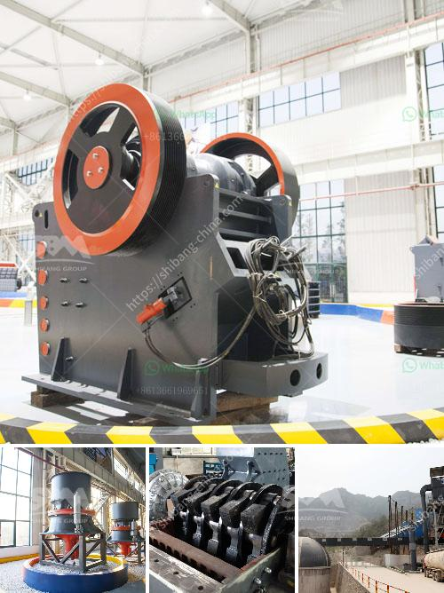

<h3>aggregate quarries crusher in thailand</h3>
Thailand is a country of great diversity in terms of landscapes and natural resources. One valuable resource is the limestone found in various areas throughout the country, particularly in the northern region. These limestone deposits are used to produce aggregates that play a crucial role in construction projects.

Aggregate quarries crushers are essential equipment in the mining and construction industry. They are specifically designed to break down large rocks into smaller, more manageable sizes for use in various applications, such as road construction, concrete production, and building foundations.

In Thailand, aggregate quarries crushers are operated by both public and private sectors. The government-owned quarry crushers are managed under the Department of Highways, while private companies own and operate the others. This mix of ownership ensures a steady supply of aggregates to meet the growing demand for construction materials in the country.

The process of extracting limestone from quarries involves several stages. Initially, the overburden, which is the topsoil and vegetation covering the limestone deposit, needs to be removed. Once the overburden is cleared, drilling and blasting techniques are used to fracture the limestone into manageable pieces.

Once the limestone rocks are broken down, they are transported to the crusher for further processing. The crushers are powerful machines that crush the rocks into various sizes, depending on the specific requirements of the project. These sizes typically range from dust particles to pebbles, which are then sorted and used accordingly.

The use of aggregate quarries crushers in Thailand is vital for the booming construction industry. These crushers not only provide the necessary raw materials for construction projects but also contribute to the country's economic growth. The demand for aggregates is increasing, driven by the government's infrastructure projects, private housing developments, and the growth of the tourism industry.

However, the operation of aggregate quarries crushers has raised environmental concerns. The extraction of limestone and the crushing process produce a significant amount of dust and noise, which can have adverse effects on the surrounding ecosystems and nearby communities. To mitigate these impacts, the government and private quarry operators have implemented various measures, such as dust suppression systems and noise barriers, to minimize the environmental footprint.

Additionally, sustainable quarrying practices, such as land reclamation and rehabilitation efforts, are being pursued to restore disturbed areas and conserve natural resources. The rehabilitation of quarries includes replanting native vegetation and restoring the natural terrain, ensuring that the areas are returned to their original state or repurposed for other beneficial uses.

In conclusion, aggregate quarries crushers in Thailand play a crucial role in the construction industry by providing the necessary raw materials for infrastructure projects. These crushers have contributed to Thailand's economic growth and development, despite the environmental challenges they pose. With sustainable quarrying practices and continuous efforts to mitigate environmental impacts, the industry is striving to balance economic growth with environmental stewardship.
<h3>Contact us</h3><ul><li><strong>Whatsapp:&nbsp;<a href="https://wa.me/8613661969651">+8613661969651</a></strong></li><li><a href="https://swt.shibang-china.com/?git&amp;zhl&amp;aggregate quarries crusher in thailand"><strong>Online Service(chat now)</strong></a></li></ul><h3>Related</h3><ul><li><a href='ball mills for rent.md'>ball mills for rent</a></li><li><a href='300 tons per hour mobile crawler crusher price.md'>300 tons per hour mobile crawler crusher price</a></li><li><a href='price 100 tph crusher plant.md'>price 100 tph crusher plant</a></li><li><a href='price of diamond mining construction.md'>price of diamond mining construction</a></li><li><a href='marble stone grinder mill.md'>marble stone grinder mill</a></li></ul>