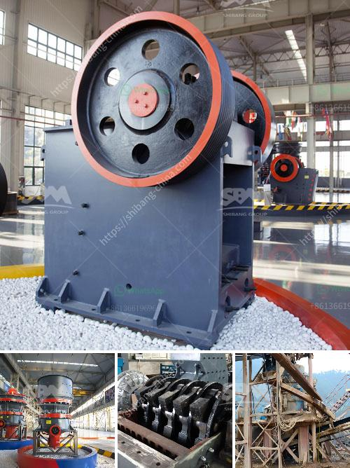

<h3>aggregate quarry crusher philippines</h3>
The Philippines is a country rich in mineral resources. The mining industry plays a crucial role in the economic development of the country. Amidst the COVID-19 pandemic, the mining industry in the Philippines is showing signs of resilience and continues to contribute significantly to the economy.

One of the key components of the mining industry is the quarrying of materials such as limestone, marble, and gravel, which are used in various construction projects including the building of roads and infrastructure. In the Philippines, there is a growing demand for aggregates, making it an attractive business opportunity for local and foreign investors.

An aggregate quarry crusher is a machine designed to grind or pulverize various types of rock into small, relatively uniform pieces. Aggregate quarry crushers are used in mining, quarrying, and recycling operations. Several types of crushers can perform this task including hammer mills, roller crushers, jaw crushers, and gyratory crushers.

An aggregate crusher can be relatively small, like the mobile units used for reclaiming recycled asphalt, or huge machines that can process thousands of tons of material a day. Aggregate crushers are used to produce crushed stone for construction purposes.

Why would you need an aggregate quarry crusher in the Philippines? The Philippines is one of the fastest-growing economies in Southeast Asia, with a high demand for raw materials, including aggregates for construction. The booming infrastructure sector requires consistent supply of aggregates to fulfill the growing demands of the industry.

Moreover, the government's prioritization of infrastructure development, along with foreign investments pouring into the country, further bolsters the need for aggregate crushers. Large-scale infrastructure projects like highways, railways, and bridges require massive amounts of aggregates for their construction. As a result, the aggregate quarry crusher business is booming.

In conclusion, aggregate quarry crushers in the Philippines are essential for the construction industry and play a vital role in the economic development of the country. Mining companies with quarries in the Philippines can take advantage of the booming demand for aggregates, making this industry a profitable investment opportunity.
<h3>Contact us</h3><ul><li><strong>Whatsapp:&nbsp;<a href="https://wa.me/8613661969651">+8613661969651</a></strong></li><li><a href="https://swt.shibang-china.com/?git&amp;zhl&amp;aggregate quarry crusher philippines"><strong>Online Service(chat now)</strong></a></li></ul><h3>Related</h3><ul><li><a href='open cast coal mining machinery process.md'>open cast coal mining machinery process</a></li><li><a href='manganese ore washing plant and crusher in zambia.md'>manganese ore washing plant and crusher in zambia</a></li><li><a href='granite crusher price in nigeria.md'>granite crusher price in nigeria</a></li><li><a href='basalt processing machine.md'>basalt processing machine</a></li><li><a href='different types of coal pulverizing ball mills.md'>different types of coal pulverizing ball mills</a></li></ul>