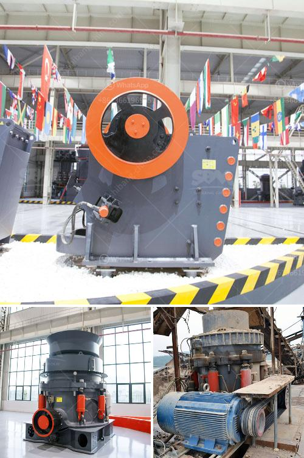

<h3>aggregate screening equipment</h3>
Aggregate screening equipment plays a crucial role in the construction and mining industries as it efficiently separates and sorts various materials such as sand, gravel, and crushed stone. By utilizing advanced technologies and designs, these equipment solutions have become indispensable tools for enhancing productivity and ensuring the quality of final products. This article will provide an overview of aggregate screening equipment, its key benefits, and the latest advancements in the field.

Aggregate screening equipment optimizes the process of separating and classifying different materials based on their size, shape, and composition. This unit not only removes unwanted debris but also accurately grades the materials to ensure consistency and uniformity. With the ability to handle high volumes of material, screening equipment reduces downtime and improves operational efficiency.

Whether it is for road construction, building foundations, or aggregate processing plants, screening equipment proves its versatility across multiple industries. For instance, in mining operations, it is crucial for separating valuable minerals from the waste rock. Similarly, in recycling facilities, these equipment solutions are employed to sort and recover various materials such as crushed concrete, asphalt, and demolition waste.

1. Vibrating Screens: Vibrating screens are one of the most commonly used screening equipment. They consist of a vibrating deck with different-sized meshes that vibrate to separate materials based on their size. These screens are highly flexible, allowing adjustments to be made depending on specific requirements.

2. Scalping Screens: Scalping screens are designed for heavy-duty applications and are primarily used for removing oversized materials from the feed. These screens have larger openings and can withstand higher tonnages, making them ideal for primary screening. They help prevent damage to downstream equipment and ensure an even flow of material.

1. Improved Product Quality: By efficiently separating and classifying materials, advanced screening equipment ensures high-quality end products. This can significantly enhance customer satisfaction and boost the reputation of the company.

2. Enhanced Productivity: With high screening capacity and faster processing times, these equipment solutions improve productivity. They help save both time and costs by minimizing manual labor and reducing material wastage.

3. Minimal Downtime: Modern screening equipment is robust, reliable, and designed for heavy-duty operations. With minimal maintenance requirements, these machines deliver enhanced uptime and increased equipment longevity.

4. Customization and Adaptability: Screening equipment can be customized to meet specific industry needs. Whether it is adjusting the slope, deck arrangement, or optimizing the amplitude and frequency of vibrations, the adaptability of these machines ensures optimal performance.

Aggregate screening equipment revolutionizes the way materials are processed, enhancing efficiency, productivity, and the quality of final products. The ability to separate and classify materials accurately enables construction and mining companies to meet project requirements and deliver exceptional results. With advancements in technology, these machines continue to evolve, offering greater versatility and adaptability for various industries. Investing in high-quality aggregate screening equipment is undoubtedly a wise decision for businesses seeking to maximize profitability and stay ahead in the competitive market.
<h3>Contact us</h3><ul><li><strong>Whatsapp:&nbsp;<a href="https://wa.me/8613661969651">+8613661969651</a></strong></li><li><a href="https://swt.shibang-china.com/?git&amp;zhl&amp;aggregate screening equipment"><strong>Online Service(chat now)</strong></a></li></ul><h3>Related</h3><ul><li><a href='cannabis mechoire cannabis crusher in pakistan.md'>cannabis mechoire cannabis crusher in pakistan</a></li><li><a href='vibrating screens pictures.md'>vibrating screens pictures</a></li><li><a href='denver lab jaw crusher.md'>denver lab jaw crusher</a></li><li><a href='stone crusher in philippines.md'>stone crusher in philippines</a></li><li><a href='for selection of coal mill.md'>for selection of coal mill</a></li></ul>