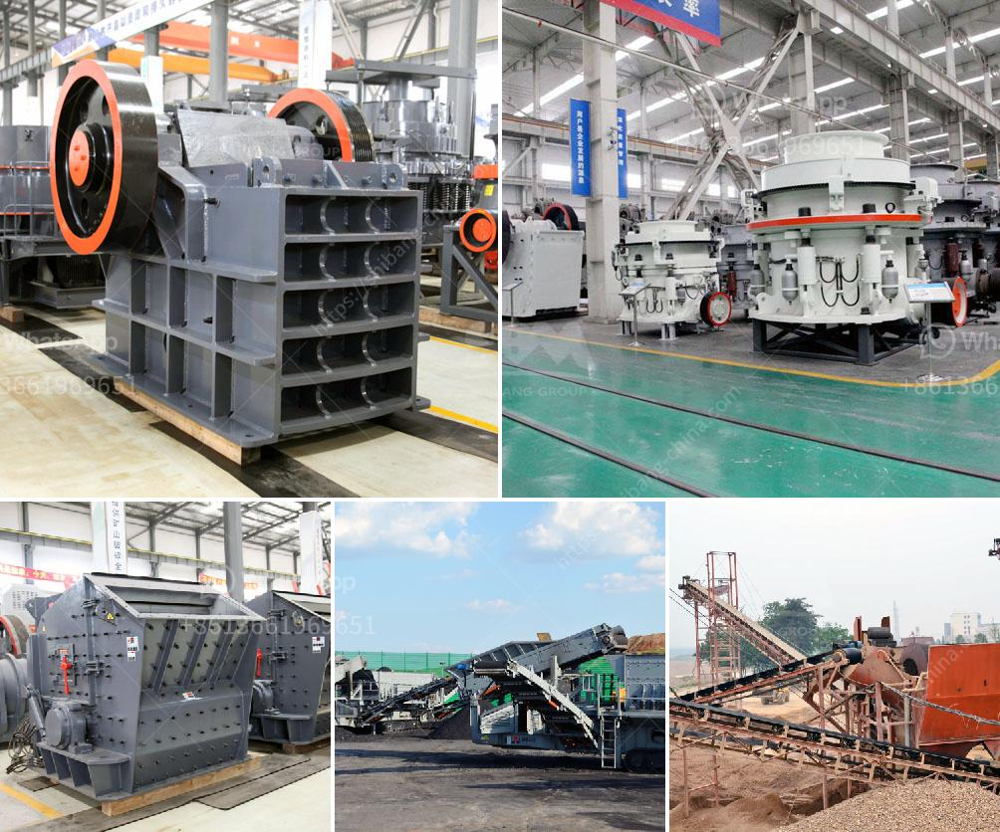

<h3>aggregates plant for construction</h3>
Construction projects form the backbone of our society, providing us with a framework for living, working, and enjoying recreational activities. These projects require a strong foundation to ensure durability and stability, which is where aggregates plants play a crucial role. Aggregates plants are facilities that process and produce various types of aggregates, including crushed stone, sand, gravel, and recycled materials, bringing them together to form the building blocks of construction.

The primary function of aggregates plants is to obtain aggregates from natural sources like quarries or mines and refine them to meet the specific requirements of construction projects. They are responsible for processing raw materials into various grades and sizes, ensuring they are suitable for specific applications. For example, crushed stone produced by aggregates plants can be used as a base material for roads, driveways, and foundations, while sand and gravel are vital components in the production of concrete.

One of the advantages of aggregates plants is their ability to supply large quantities of materials consistently. These plants are equipped with state-of-the-art machinery and equipment that can process vast amounts of raw materials efficiently. Through crushing, screening, washing, and sorting processes, aggregates plants can produce a wide range of high-quality materials in different sizes to cater to the diverse needs of construction projects.

Apart from their ability to supply materials in bulk, aggregates plants also contribute significantly to sustainability efforts in the construction industry. With the growing focus on sustainable practices, many aggregates plants incorporate recycling facilities into their operations. These plants can process and reuse waste concrete, asphalt, and other construction materials, reducing the need for virgin resources and minimizing waste sent to landfills.

Moreover, aggregates plants incorporate technologies that help reduce their ecological footprint. Efficient use of water, energy, and other resources help minimize their impact on the environment while maximizing production. Dust control measures are also implemented to reduce air pollution during the quarrying and extraction processes.

The efficiency and reliability of aggregates plants play a vital role in meeting construction project schedules and deadlines. These plants supply the necessary materials to contractors and builders in a timely manner, ensuring that projects can progress smoothly without delays. They form an essential link in the construction supply chain, collaborating with other stakeholders like transportation companies to ensure the seamless delivery of materials to project sites.

In conclusion, aggregates plants are indispensable facilities in the construction industry. They process and produce essential materials that form the foundation of infrastructure projects, ensuring durability and stability. With their ability to supply large quantities of high-quality materials consistently, incorporate recycling facilities, and implement sustainable practices, aggregates plants contribute significantly to the sustainability and efficiency of construction projects. As infrastructure requirements continue to grow, the role of aggregates plants in supporting the development of societies worldwide becomes more critical than ever.
<h3>Contact us</h3><ul><li><strong>Whatsapp:&nbsp;<a href="https://wa.me/8613661969651">+8613661969651</a></strong></li><li><a href="https://swt.shibang-china.com/?git&amp;zhl&amp;aggregates plant for construction"><strong>Online Service(chat now)</strong></a></li></ul><h3>Related</h3><ul><li><a href='used 200 tph stone crusher sale sale in india.md'>used 200 tph stone crusher sale sale in india</a></li><li><a href='vibrating screen for fine sand.md'>vibrating screen for fine sand</a></li><li><a href='crusher for sale in dubai.md'>crusher for sale in dubai</a></li><li><a href='used portable stone crushers for sale ontario.md'>used portable stone crushers for sale ontario</a></li><li><a href='screen plants for shade.md'>screen plants for shade</a></li></ul>