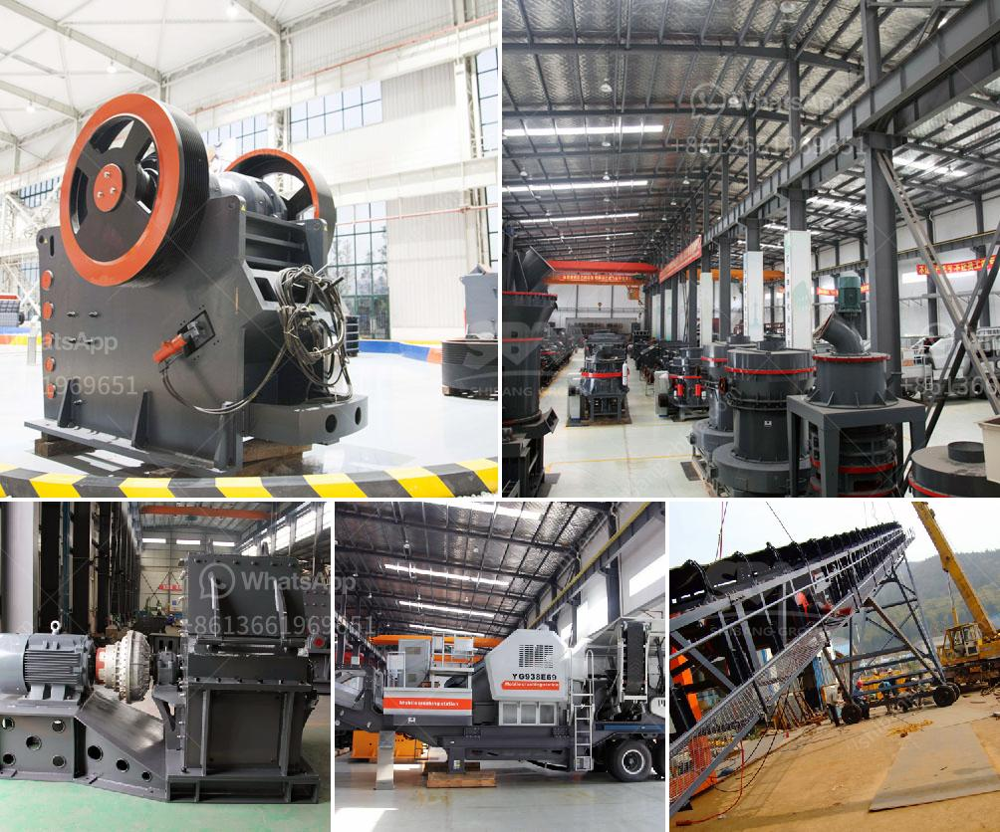

<h3>allis chalmers 54 x 74 gyratory crusher</h3>
The Allis Chalmers 54 x 74 gyratory crusher is a renowned piece of machinery that has been designed and built by industry professionals. This model of crusher, also known as the MK II, is ideal for medium capacity production and it is built for continuous, demanding crushing applications.

The Allis Chalmers gyratory crusher features a tall, robust design that holds up to harsh conditions and heavy workloads. It is superior in terms of durability and reliability. The crusher's compactness is accompanied by excellent performance, with high crushing capacity and efficiency.

One remarkable aspect of the Allis Chalmers gyratory crusher is its versatility. It comes with a variety of configurations, enabling different types of crushing processes. The cone crusher can be adjusted to different crushing chamber settings depending on the desired product size requirements. This versatility is especially useful in industries such as mining, where different types of materials need to be crushed.

Furthermore, the Allis Chalmers gyratory crusher is equipped with an automatic setting system. These systems help optimize the crusher's performance by automatically adjusting the crusher settings to maintain the desired product size. This allows for better control and efficiency during the crushing process.

Maintenance for the Allis Chalmers gyratory crusher is also straightforward. The crusher's robust design and quality materials ensure that it is durable and long-lasting. Regular maintenance checks and servicing can enhance the overall lifespan of the crusher, ensuring its continuous operation and reliable performance.

In conclusion, the Allis Chalmers 54 x 74 gyratory crusher is a well-designed and robust machine that is ideal for medium capacity production. Its versatility and automatic setting system make it an excellent choice for a wide range of crushing applications. With regular maintenance, this crusher can continue to deliver efficient and reliable performance for many years to come.
<h3>Contact us</h3><ul><li><strong>Whatsapp:&nbsp;<a href="https://wa.me/8613661969651">+8613661969651</a></strong></li><li><a href="https://swt.shibang-china.com/?git&amp;zhl&amp;allis chalmers 54 x 74 gyratory crusher"><strong>Online Service(chat now)</strong></a></li></ul><h3>Related</h3><ul><li><a href='machine for limestone river gravel stone.md'>machine for limestone river gravel stone</a></li><li><a href='200tph vsi crushers.md'>200tph vsi crushers</a></li><li><a href='cement plant maintenance manual pdf.md'>cement plant maintenance manual pdf</a></li><li><a href='micro fine powder grinder.md'>micro fine powder grinder</a></li><li><a href='design drawings of a hammer mill.md'>design drawings of a hammer mill</a></li></ul>