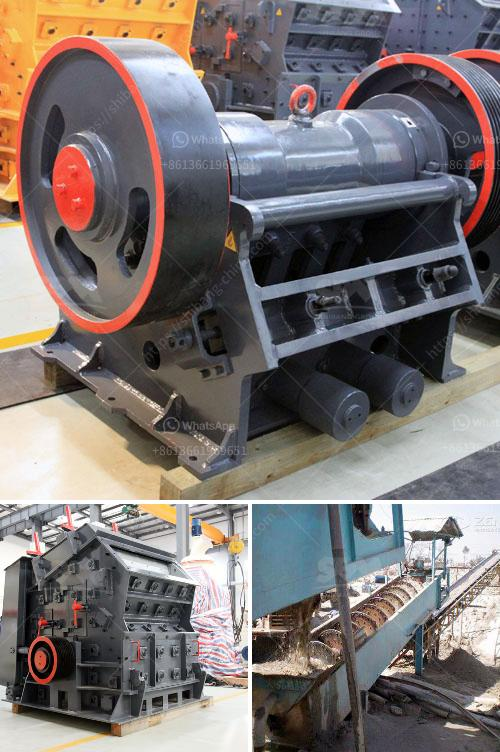

<h3>alluvial gold mining in zimbabwe</h3>
Alluvial gold mining in Zimbabwe is a lucrative business that has attracted numerous illegal artisanal miners from all over the country. This is because alluvial gold mining is an easy and cheap process to engage in. One just needs to locate a fertile ground, expose the gravel layers, and retrieve the particles of gold.

However, it is not always a bed of roses for the artisanal miners who engage in alluvial gold mining. There are several challenges that they face throughout the mining process.

Firstly, these miners have to deal with government regulations and bureaucracy. The government has imposed strict regulations on alluvial mining activities to preserve the environment and also to control illegal mining. These regulations include obtaining mining licenses, environmental impact assessments, and paying various taxes and royalties. These processes are not always easy to navigate, especially for the artisanal miners who lack the necessary resources and knowledge.

Additionally, alluvial gold miners often face security challenges. There have been numerous cases of conflicts and violence among miners, particularly as they compete for the limited fertile ground. These conflicts arise due to the absence of a clear legal framework and system for allocating mining claims. The absence of a proper regulatory mechanism has led to the rise of illegal miners who often engage in perpetuating violence.

Furthermore, alluvial gold mining poses several environmental risks. The process of exposing the gravel layers leads to the destruction of vegetation and the disturbance of soil structure. This, in turn, results in erosion and the siltation of rivers and streams. The chemicals and pollutants used in the gold extraction process also find their way into water bodies, further degrading the environment and endangering aquatic life.

The economic benefits of alluvial gold mining cannot be ignored. Zimbabwe has a rich reserve of gold, predominantly concentrated in the alluvial deposits that are found along rivers and streams. Mining gold from these alluvial deposits can be lucrative for both large-scale commercial miners and small-scale artisanal miners.

Alluvial gold mining provides employment opportunities for countless individuals in Zimbabwe, particularly in rural areas. The activity has the potential to alleviate poverty, create jobs, and generate income for local communities. This is crucial, considering the high unemployment rates that Zimbabwe continues to grapple with.

Nevertheless, it is imperative for the Zimbabwean government to address the challenges faced by alluvial gold miners. There is a need for a comprehensive legal framework that regulates and formalizes the alluvial gold mining sector. This will not only ensure environmental sustainability but also enhance security and curb illegal mining activities.

Moreover, the government should invest in supporting small-scale artisanal miners. Providing them with training, access to modern mining technologies, and financial assistance will go a long way in improving their efficiency and productivity. In doing so, the government can harness the full potential of alluvial gold mining and maximize its economic benefits for the country.

In conclusion, alluvial gold mining in Zimbabwe is a promising business venture that can contribute to the country's economic development. However, it is essential to address the challenges and risks associated with this activity to ensure its sustainability and maximize its benefits. By regulating the sector, promoting security, and providing support to small-scale miners, Zimbabwe can tap into the gold reserves and improve the livelihoods of its citizens.
<h3>Contact us</h3><ul><li><strong>Whatsapp:&nbsp;<a href="https://wa.me/8613661969651">+8613661969651</a></strong></li><li><a href="https://swt.shibang-china.com/?git&amp;zhl&amp;alluvial gold mining in zimbabwe"><strong>Online Service(chat now)</strong></a></li></ul><h3>Related</h3><ul><li><a href='vibrating screen manufacture in philippines.md'>vibrating screen manufacture in philippines</a></li><li><a href='ball mill in aluminum plant equipments.md'>ball mill in aluminum plant equipments</a></li><li><a href='cost of 100 tpd cement plant.md'>cost of 100 tpd cement plant</a></li><li><a href='portable crushing equipment.md'>portable crushing equipment</a></li><li><a href='wet and dry ball milling.md'>wet and dry ball milling</a></li></ul>