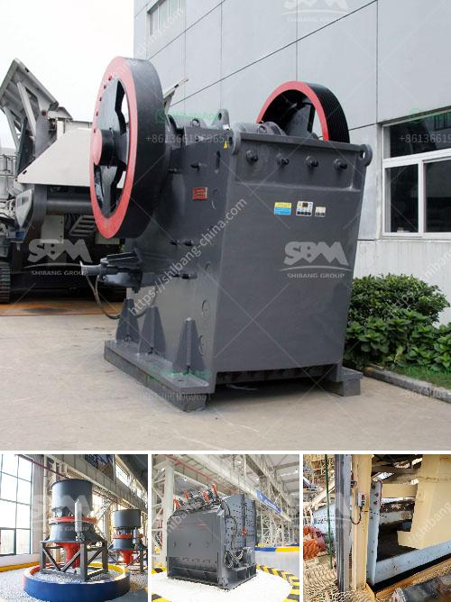

<h3>alluvial gold mining machines</h3>
Alluvial gold mining machines are not rare nowadays. The mining industry is transitioning into a new technological age, and these machines are the first step in this evolution. This article will explore alluvial gold mining machines and their key features, advantages, and the benefits they bring to the mining industry.

Alluvial gold mining machines are specially designed to extract gold particles from sediments or alluvial deposits. These machines use a variety of techniques, such as hydraulic mining, mechanized methods, and water-based techniques to extract gold particles. The machines are equipped with specific tools and equipment to extract gold efficiently and effectively.

One of the key features of alluvial gold mining machines is their ability to handle a wide range of soil types and sediments. They are designed to process large volumes of materials and are capable of extracting tiny gold particles from various types of fine sediment, such as sand, silt, and clay. This makes them highly versatile and suitable for different mining locations and environments.

The machines are also known for their high processing capacity, allowing mining companies to extract gold on a large scale. These machines are specifically designed to maximize efficiency and minimize downtime. They are equipped with strong and durable components, ensuring reliable performance even in the toughest mining conditions.

Another advantage of alluvial gold mining machines is their low environmental impact. These machines use water-based techniques, which are much less destructive to the environment compared to traditional mining methods. They eliminate the need for chemical-based extraction processes, reducing pollution and minimizing the disturbance to natural habitats.

In addition to their low environmental impact, these machines also contribute to the sustainability of the mining industry. They require less energy to operate and have a lower carbon footprint compared to conventional mining equipment. This leads to reduced operating costs and improved profitability for mining companies.

Alluvial gold mining machines are also highly automated, further enhancing their efficiency and productivity. They are equipped with advanced technology, such as sensors, cameras, and control systems, which enable them to operate autonomously and optimize the extraction process. This automation reduces the need for manual labor and enhances safety, as workers are not required to be in close proximity to the extraction site.

In conclusion, alluvial gold mining machines are an integral part of the mining industry's technological advancement. They offer a range of benefits, including their versatility, high processing capacity, low environmental impact, and contribution to sustainability. These machines are a step towards a more efficient, responsible, and profitable mining industry. With ongoing research and development, alluvial gold mining machines will continue to evolve and revolutionize the mining industry.
<h3>Contact us</h3><ul><li><strong>Whatsapp:&nbsp;<a href="https://wa.me/8613661969651">+8613661969651</a></strong></li><li><a href="https://swt.shibang-china.com/?git&amp;zhl&amp;alluvial gold mining machines"><strong>Online Service(chat now)</strong></a></li></ul><h3>Related</h3><ul><li><a href='crushing machines for rent in uae.md'>crushing machines for rent in uae</a></li><li><a href='calcium carbonate rock crusher.md'>calcium carbonate rock crusher</a></li><li><a href='clay aggregate machinery product.md'>clay aggregate machinery product</a></li><li><a href='metal crusher for sale in turkey.md'>metal crusher for sale in turkey</a></li><li><a href='ore beneficiation equipment suppliers china.md'>ore beneficiation equipment suppliers china</a></li></ul>