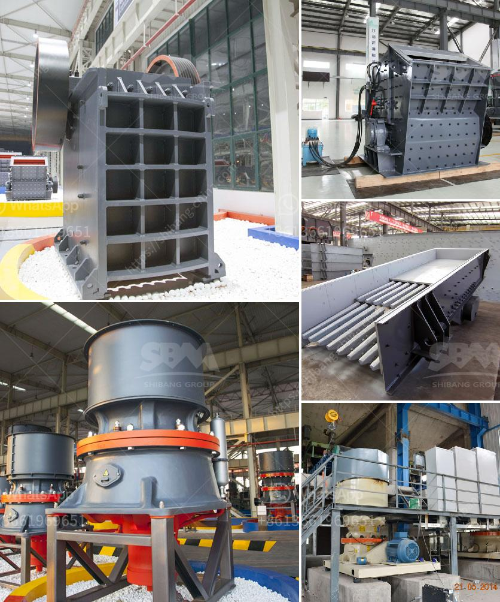

<h3>alluvial mining wash plant in canada</h3>
Alluvial mining is the extraction of valuable minerals or metals from the surface of the earth using various techniques. One of the most common methods used in mining alluvial deposits is through the use of wash plants. These plants are engineered to efficiently wash away dirt, gravel, and other materials to extract valuable minerals.

In Canada, alluvial mining wash plants are commonly used to process sand and gravel deposits. These deposits are typically found in river channels, floodplains, and deltas, where the land has been shaped by water erosion. The quality and quantity of alluvial deposits can vary greatly, making it important to have efficient wash plants that can recover the maximum amount of valuable minerals.

The wash plant used in alluvial mining in Canada typically includes a hopper, trommel, or a screen to separate the larger particles from the smaller ones. Water is then used to wash away the unwanted materials, leaving behind the valuable minerals or metals.

One of the advantages of utilizing a wash plant in alluvial mining is its ability to process large amounts of material in a relatively short period. This makes it an efficient mining method for extracting minerals in large quantities. Additionally, wash plants can be easily moved from one location to another, allowing miners to access different areas with ease.

Alluvial mining wash plants in Canada are often equipped with sluice boxes or jigs. These devices help to concentrate the heavy minerals and separate them from lighter materials. Sluice boxes use the flow of water and gravity to separate the minerals, while jigs use pulsating water to create a fluid bed where the minerals settle.

In recent years, advancements in technology have improved the efficiency and effectiveness of alluvial mining wash plants. Some newer wash plants are equipped with advanced features such as automatic feed control, adjustable vibration, and variable speed controls. These features allow for better control over the washing process, resulting in higher recovery rates and better overall performance.

In conclusion, alluvial mining wash plants are essential equipment in processing sand and gravel deposits in Canada. These plants are designed to efficiently wash away unwanted materials, leaving behind valuable minerals or metals. With advancements in technology, wash plants have become more effective and efficient in recovering minerals. As the demand for these resources continues to grow, the use of wash plants in alluvial mining is expected to increase, driving further innovation and improvements in the industry.
<h3>Contact us</h3><ul><li><strong>Whatsapp:&nbsp;<a href="https://wa.me/8613661969651">+8613661969651</a></strong></li><li><a href="https://swt.shibang-china.com/?git&amp;zhl&amp;alluvial mining wash plant in canada"><strong>Online Service(chat now)</strong></a></li></ul><h3>Related</h3><ul><li><a href='conveyor belts nigeria.md'>conveyor belts nigeria</a></li><li><a href='mkobo crushing and screen.md'>mkobo crushing and screen</a></li><li><a href='cement plant for sale intpd.md'>cement plant for sale intpd</a></li><li><a href='conventional stone crushers in peru.md'>conventional stone crushers in peru</a></li><li><a href='jaw crusher of zenith.md'>jaw crusher of zenith</a></li></ul>