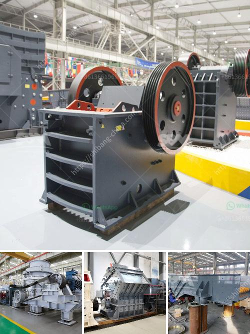

<h3>alluvial mobile diamond processing plant</h3>
Diamonds are one of the most precious gemstones in the world. They hold immense value not only because of their rarity but also due to their beauty and durability. The diamond industry constantly strives to find new and innovative ways to extract, process and refine these gemstones. One such revolutionary development is the alluvial mobile diamond processing plant.

The alluvial mobile diamond processing plant is a unique concept that has been developed to meet the needs of small-scale miners in diamond-rich areas. This portable plant offers advanced technology, coupled with efficiency and low maintenance costs. It enables the rapid and efficient processing of diamonds, even in remote locations.

One of the key features of the alluvial mobile diamond processing plant is its mobility. This plant can be easily transported to different sites, allowing miners to access diamond deposits in various locations. This mobility eliminates the need for miners to travel long distances to centralized processing facilities, saving time and money.

Another advantage of the alluvial mobile diamond processing plant is its ability to process a wide range of diamond sizes. The plant is equipped with advanced screening and sorting machinery that can effectively separate diamonds based on their size and quality. This ensures that only the highest quality diamonds are extracted, resulting in greater profitability for miners.

Moreover, the alluvial mobile diamond processing plant is designed to be environmentally friendly. It incorporates state-of-the-art water recycling systems and utilizes clean energy sources, minimizing its carbon footprint. This makes it an ideal choice for miners who are conscious of their environmental impact.

In conclusion, the alluvial mobile diamond processing plant is a game-changer for the diamond industry. Its mobility, efficiency, and versatility make it an essential tool for small-scale miners operating in diamond-rich areas. Furthermore, its eco-friendly design aligns with the industry's growing focus on sustainable practices. With this innovative technology at their disposal, miners can maximize their productivity and profitability while contributing to a sustainable future for the diamond industry.
<h3>Contact us</h3><ul><li><strong>Whatsapp:&nbsp;<a href="https://wa.me/8613661969651">+8613661969651</a></strong></li><li><a href="https://swt.shibang-china.com/?git&amp;zhl&amp;alluvial mobile diamond processing plant"><strong>Online Service(chat now)</strong></a></li></ul><h3>Related</h3><ul><li><a href='america stone crusher price.md'>america stone crusher price</a></li><li><a href='100tph stone crusher plant.md'>100tph stone crusher plant</a></li><li><a href='river sand suppliers in northern cape.md'>river sand suppliers in northern cape</a></li><li><a href='used cone crushers for sale 50 ton per hour.md'>used cone crushers for sale 50 ton per hour</a></li><li><a href='mining plant for sale harare zimbabwe.md'>mining plant for sale harare zimbabwe</a></li></ul>