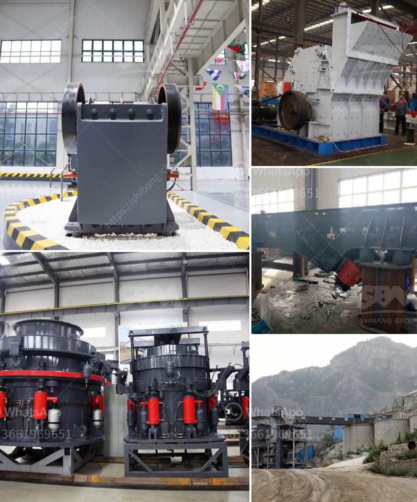

<h3>america stone crusher price</h3>
The demand for crushed stone is increasing rapidly in America, as it is used in the construction of roads, bridges, buildings, and other infrastructure projects. The stone crushing industry is a major contributor to the economy and employment generation in the United States. With the increasing demand for stone, it is crucial to have efficient and cost-effective stone crushers in the market.

The price of stone crushers in America varies depending on the specific model, capacity, and features. However, there are several factors that influence the price of stone crushers in the market. First, the cost of raw materials plays a significant role in determining the price. The prices of raw materials such as steel, concrete, and aggregates fluctuate, affecting the overall production cost of stone crushers.

Second, the manufacturing process and technology utilized by different manufacturers also impact the price of stone crushers. Manufacturers who invest in advanced machinery and technology often charge a higher price for their products, as they offer better efficiency and durability.

Third, the demand-supply dynamics of stone crushers in the market also influence the price. If the demand for stone crushers is high, manufacturers tend to increase the price to maximize their profits. On the other hand, if the supply surpasses the demand, manufacturers may offer competitive prices to attract buyers and maintain their market share.

Generally, stone crushers in America are priced between $50,000 to $500,000, depending on the type and capacity of the crusher. Small-scale stone crushers with a capacity of 50-100 tons per hour are available at lower price points, typically ranging from $50,000 to $100,000. Medium-sized stone crushers with a capacity of 100-300 tons per hour are priced between $100,000 to $300,000. Large-scale stone crushers with a capacity of 300-500 tons per hour can cost anywhere from $300,000 to $500,000 or more.

It is essential for buyers to consider not only the price of the stone crusher but also its performance, reliability, and after-sales service. Buyers should research different models and manufacturers to find the best combination of price and quality that meets their specific requirements. Additionally, buyers should also consider the availability of spare parts and support services, as regular maintenance and occasional repairs are necessary for the proper functioning of stone crushers.

In conclusion, the demand for stone crushers in America is growing rapidly due to the construction boom and infrastructure development. The price of stone crushers in the market varies based on factors such as raw material costs, manufacturing processes, and demand-supply dynamics. Buyers should carefully evaluate different options and consider the performance and after-sales service of stone crushers before making a purchase. Investing in a reliable and efficient stone crusher can significantly enhance productivity and profitability in the construction industry.
<h3>Contact us</h3><ul><li><strong>Whatsapp:&nbsp;<a href="https://wa.me/8613661969651">+8613661969651</a></strong></li><li><a href="https://swt.shibang-china.com/?git&amp;zhl&amp;america stone crusher price"><strong>Online Service(chat now)</strong></a></li></ul><h3>Related</h3><ul><li><a href='aggregate concrete plant.md'>aggregate concrete plant</a></li><li><a href='gold refining equipment toronto.md'>gold refining equipment toronto</a></li><li><a href='silica sand grinding machine.md'>silica sand grinding machine</a></li><li><a href='singapore mining conveyor belt supplier.md'>singapore mining conveyor belt supplier</a></li><li><a href='fine powder milling machines.md'>fine powder milling machines</a></li></ul>