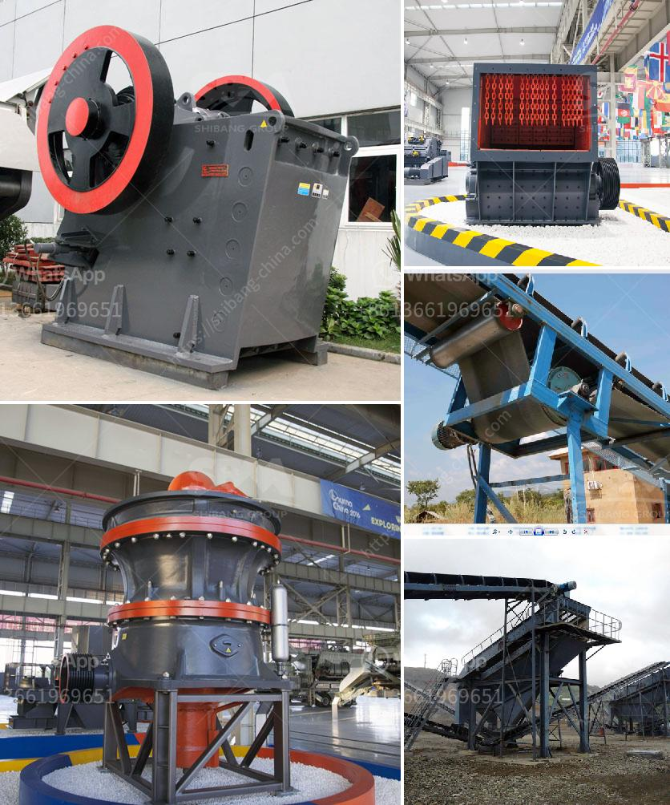

<h3>american cone crushers</h3>
Cone crushers are one of the most advanced and reliable crushing technology in the market today. With excellent performance and high durability, cone crushers have been widely used in the mining industry, metallurgical industry, and construction industry. Among various cone crushers available, American cone crushers have gained immense popularity for their exceptional features and benefits.

American cone crushers are designed to deliver high production output, easy maintenance, and increased uptime. These crushers are equipped with innovative hydraulic systems, providing easy and efficient adjustment of the crusher settings. With the hydraulic clearing system, operators can quickly clear the crushing chamber in case of any blockages, avoiding downtime and maximizing productivity.

Additionally, the design of American cone crushers ensures enhanced safety for the operators. The anti-spin system prevents the cone head from spinning during abnormal load conditions, preventing potential damage to the crusher. Furthermore, the hydraulic tramp release system prevents any non-crushable material from entering the crushing chamber, minimizing the risk of equipment damage.

Another remarkable feature of American cone crushers is their versatility in crushing different types of materials. Whether it is a hard rock, a soft rock, or even abrasive materials, American cone crushers deliver consistent and high-quality end products.

Furthermore, American cone crushers come in a wide range of sizes and configurations, allowing operators to choose the right crusher for their specific needs. Whether it is a mobile or stationary crushing application, American cone crushers offer flexible solutions to meet various requirements.

In conclusion, American cone crushers have revolutionized the crushing technology with their exceptional performance, durability, and safety features. With their ability to handle various materials and their versatility in applications, American cone crushers have become an integral part of the mining, metallurgical, and construction industries. As the demand for high-quality aggregates continues to grow, American cone crushers will play a vital role in meeting these requirements efficiently and effectively.
<h3>Contact us</h3><ul><li><strong>Whatsapp:&nbsp;<a href="https://wa.me/8613661969651">+8613661969651</a></strong></li><li><a href="https://swt.shibang-china.com/?git&amp;zhl&amp;american cone crushers"><strong>Online Service(chat now)</strong></a></li></ul><h3>Related</h3><ul><li><a href='used stone crusher machine in italia.md'>used stone crusher machine in italia</a></li><li><a href='impact crusher machine supplier.md'>impact crusher machine supplier</a></li><li><a href='china coal mill grinder manufacturers china.md'>china coal mill grinder manufacturers china</a></li><li><a href='portable crushing mill.md'>portable crushing mill</a></li><li><a href='conveyor belt equipment for mining south africa.md'>conveyor belt equipment for mining south africa</a></li></ul>