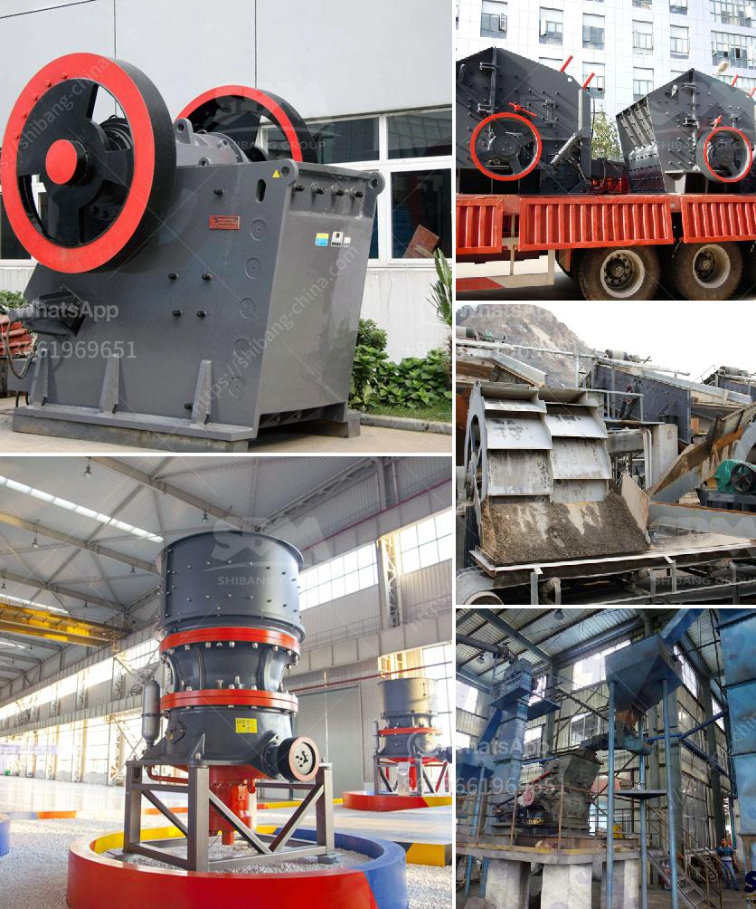

<h3>are vertical ultrafine mill roller</h3>
Vertical ultrafine mill roller, also known as high-pressure roller mill or high-pressure suspension roller mill, is an efficient and energy-saving superfine powder processing equipment developed by integrating advanced technology from abroad and combining the specific production needs of domestic users. With its unique advantages and excellent performance, it has been widely used in various industries.

This vertical ultrafine mill roller has several notable features that give it a competitive edge in the market. Firstly, it has a high grinding efficiency. The grinding roller and grinding ring are made of special wear-resistant steel, which can effectively avoid unnecessary wear and tear during the operation of the equipment. The advanced grinding principle and the scientific design of the grinding cavity ensure that the material is ground to the required fineness in a short time, greatly increasing the processing capacity.

Secondly, this vertical ultrafine mill roller has a wide range of applications. It can be used for grinding various non-metallic minerals, such as calcium carbonate, barite, talc, kaolin, limestone, and so on. In addition, it can also be used for processing fine powders of non-flammable and explosive materials with a hardness below 7 and a humidity below 6%, such as gypsum, bentonite, and coal gangue. Its versatility makes it suitable for use in many industries, including mining, metallurgy, chemical engineering, cement, construction, and more.

Another advantage of this vertical ultrafine mill roller is its energy-saving performance. The equipment adopts a unique air separation system, which effectively reduces the resistance of airflow and avoids excessive heat generation, thus saving energy consumption and reducing production costs. In addition, the qualified fine powder is collected by a pulse dust collector, which further reduces environmental pollution and meets the requirements of green production.

Furthermore, this vertical ultrafine mill roller has a compact structure and occupies a small space in the production plant. The transmission device adopts a closed gear box and pulley drive, which runs smoothly and has a low noise level. The electrical system adopts centralized control, making the operation more convenient and ensuring the safety of the production process.

In conclusion, the vertical ultrafine mill roller is a highly efficient and energy-saving equipment that has become an important tool for fine powder processing. Its high grinding efficiency, wide application range, energy-saving performance, and compact structure make it stand out in the market and gain the favor of users. As technology continues to advance, it is believed that this equipment will continue to evolve and bring more benefits to the industry.
<h3>Contact us</h3><ul><li><strong>Whatsapp:&nbsp;<a href="https://wa.me/8613661969651">+8613661969651</a></strong></li><li><a href="https://swt.shibang-china.com/?git&amp;zhl&amp;are vertical ultrafine mill roller"><strong>Online Service(chat now)</strong></a></li></ul><h3>Related</h3><ul><li><a href='grinding machine manufacturers and suppliers in india.md'>grinding machine manufacturers and suppliers in india</a></li><li><a href='nigeria mobile crusher.md'>nigeria mobile crusher</a></li><li><a href='granite crusher machine.md'>granite crusher machine</a></li><li><a href='talc grinding plant.md'>talc grinding plant</a></li><li><a href='rock crusher for sale philippines.md'>rock crusher for sale philippines</a></li></ul>