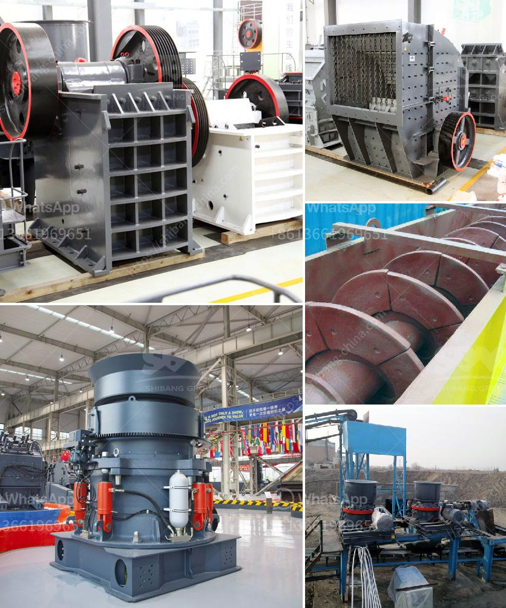

<h3>artificial marble manufacturing machineprocess india</h3>
Artificial marble, also known as engineered stone or cultured marble, is a type of composite material that is made by mixing natural marble chips, along with different resins and pigments. This material offers the aesthetic appeal of natural marble while also providing numerous advantages such as durability, affordability, and versatility. With the increasing demand for artificial marble in the construction industry, the manufacturing process has advanced significantly, especially in countries like India.

India, being one of the leading producers of natural stones, has witnessed a surge in the production of artificial marble in recent years. The manufacturing process of artificial marble involves various steps, starting from the selection and blending of raw materials. Marble chips, which are sourced from quarries, are carefully selected and sorted in terms of size, color, and quality. This ensures a consistent and high-quality final product.

After the selection process, the marble chips are mixed with a binder, such as polyester or acrylic resins, along with other additives like pigments, fillers, and stabilizers. These additives help in enhancing the physical and chemical characteristics of the artificial marble. The mixture is then poured into molds, which are customized according to the desired shape and size of the finished product.

Once the molds are filled, they are placed into a vacuum vibration table, which removes any air bubbles from the mixture and ensures uniformity. This process also helps in achieving a high-density composite material. The molds are then transferred to an oven, where they are cured at a specific temperature for a specific duration. This step is crucial, as it determines the strength, texture, and appearance of the artificial marble.

After the curing process, the molds are removed, leaving behind solid slabs or tiles of artificial marble. These slabs or tiles undergo a series of finishing processes, which include polishing, shaping, and honing. These processes bring out the natural beauty and shine of the material, making it almost indistinguishable from natural marble.

The artificial marble manufacturing machine used in India comprises state-of-the-art technology that delivers precision and efficiency in the production process. These machines are equipped with computerized control systems that ensure accurate mixing of raw materials, automated pouring into molds, and precise temperature control during the curing process. This results in consistent quality and high productivity.

The artificial marble manufacturing industry in India has witnessed substantial growth due to the increasing demand for affordable alternatives to natural marble. It has found widespread usage in the construction industry, where it is extensively used for flooring, countertops, vanity tops, wall claddings, and various other applications. The availability of a wide range of colors, patterns, and finishes makes it a versatile material that complements diverse architectural styles.

In conclusion, the artificial marble manufacturing process in India has evolved significantly, offering a cost-effective and aesthetically pleasing alternative to natural marble. With the help of advanced machinery and skilled craftsmanship, India has emerged as a leading producer of artificial marble, meeting the growing demand both domestically and internationally.
<h3>Contact us</h3><ul><li><strong>Whatsapp:&nbsp;<a href="https://wa.me/8613661969651">+8613661969651</a></strong></li><li><a href="https://swt.shibang-china.com/?git&amp;zhl&amp;artificial marble manufacturing machineprocess india"><strong>Online Service(chat now)</strong></a></li></ul><h3>Related</h3><ul><li><a href='toner production line suppliers.md'>toner production line suppliers</a></li><li><a href='stone grinding plant equipment specification.md'>stone grinding plant equipment specification</a></li><li><a href='stone crusher of aar.md'>stone crusher of aar</a></li><li><a href='crusher machine price list.md'>crusher machine price list</a></li><li><a href='used sand screening equipment for sale.md'>used sand screening equipment for sale</a></li></ul>