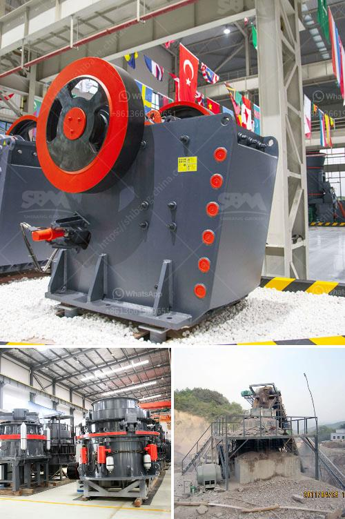

<h3>automatic stone crusher plant</h3>
Automatic stone crusher plant can be used for hard limestone, granite, basalt, more than and smelting slag and so on many kinds of materials of aggregate and making artificial sand homework, suitable for the application of hydropower, building material, highway, urban construction and other industries. Different models of machines are combined to meet different customers' different demands according to different craft requirements.

Automatic stone crusher plant process, therefore, refers to a crusher that can process rocks and minerals automatically that are extracted from the quarry while reducing its size at the same time. Both compact and powerful, the plant uses a crawler-mounted motor or a diesel engine, depending on the application, to crush rocks or debris into smaller pieces.

The plant can be automatically controlled to increase production and efficiency. It saves labor costs and reduces the need for manual labor, so operators can be more productive and focus on other tasks. Additionally, automatic stone crusher plants are environmentally friendly because they generate less dust and noise compared to traditional crushing equipment.

Moreover, they produce fewer emissions and consume less fuel and oil, reducing the impact on the environment. This makes automatic stone crusher plant an ideal choice for businesses that need to process rocks and minerals on-site.

To ensure flexibility and efficiency, the automatic stone crusher plant is equipped with an automatic control system that monitors various parameters and adjusts the settings accordingly. This system optimizes cone crusher efficiency by automatically adapting the crusher to variations in feed conditions.

By continuously measuring and compensating for crusher liner wear, the system allows you to maximize plant performance and minimize downtime. Furthermore, the automatic control system automatically adapts the plant to different feed variations, ensuring maximum productivity.

The automatic stone crusher plant is easy to operate and maintain. It consists of a crusher, a feeder, a vibrating screen, and a conveyor. It uses advanced technology, which simplifies the process, reduces production costs, and improves the overall efficiency of the plant.

The automatic stone crusher plant not only maintains high production efficiency but also comes with many energy-saving and environmental protection measures. The automatic dust removal system ensures that no dust emissions occur during the production process, thus ensuring a clean and environmentally friendly production environment for the workers.

In conclusion, the automatic stone crusher plant is a high-tech and efficient equipment that can be operated by a single worker. It integrates multiple machines, such as a pre-screening machine, fine crushing machine, conveying, and discharge systems, which simplifies the process and greatly reduces production costs without compromising the quality of the final product.
<h3>Contact us</h3><ul><li><strong>Whatsapp:&nbsp;<a href="https://wa.me/8613661969651">+8613661969651</a></strong></li><li><a href="https://swt.shibang-china.com/?git&amp;zhl&amp;automatic stone crusher plant"><strong>Online Service(chat now)</strong></a></li></ul><h3>Related</h3><ul><li><a href='coal crushing equipment.md'>coal crushing equipment</a></li><li><a href='ball mill outpot capicity 180 tph.md'>ball mill outpot capicity 180 tph</a></li><li><a href='chromite ore crushing machine.md'>chromite ore crushing machine</a></li><li><a href='hammer mill machine 20hp.md'>hammer mill machine 20hp</a></li><li><a href='roller mill ultrafine.md'>roller mill ultrafine</a></li></ul>