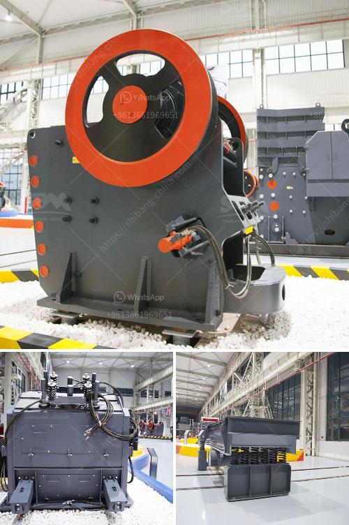

<h3>automatic terrazzo pressing machine</h3>
The terrazzo pressing machine has revolutionized the process of manufacturing terrazzo tiles. With its automated features and advanced technology, it has significantly increased efficiency, reduced labor costs, and improved tile quality.

Terrazzo flooring has been a popular choice in the construction industry for its durability, aesthetics, and versatility. Traditionally, terrazzo tiles were made by mixing cement, aggregates, and colored chips manually. This process was time-consuming, labor-intensive, and prone to human errors. However, the introduction of automatic terrazzo pressing machines has transformed the production process.

One of the key advantages of the automatic terrazzo pressing machine is its ability to automate the entire process. Previously, workers had to manually mix the ingredients and then pour the mixture into molds. With the automatic machine, the entire process is streamlined. The aggregates, color chips, and cement are automatically mixed in precise proportions, ensuring consistency in tile quality.

The machine also features a hydraulic pressing system that compresses the mixture in the mold, resulting in uniform density and thickness of the tiles. This eliminates the common problem of unevenly pressed tiles, which often occur during manual pressing. The hydraulic system also ensures a high level of precision, as it can exert a consistent amount of pressure on each tile.

Moreover, the automatic terrazzo pressing machine has significantly increased production capacity. The machine can produce a large number of tiles in a short period, which was nearly impossible with manual pressing. This has helped manufacturers meet the increasing demand for terrazzo flooring in a timely manner.

Another benefit of the automatic machine is its cost-effectiveness. By automating the process, labor costs are reduced. The machine requires minimal human intervention, reducing the need for a large workforce. Additionally, the machine optimizes the use of raw materials and minimizes wastage, further reducing production costs.

In terms of tile quality, the automatic terrazzo pressing machine ensures consistency and accuracy. The machine guarantees that each tile has the same density, thickness, and overall quality. This consistency is essential for achieving a uniform and seamless terrazzo surface when the tiles are installed.

Additionally, the machine allows manufacturers to produce a wide range of tile sizes, shapes, and patterns. The molds can be easily customized, enabling manufacturers to cater to different customer preferences and design requirements. This flexibility in design options has made terrazzo flooring even more appealing to architects, designers, and homeowners.

In conclusion, the automatic terrazzo pressing machine has revolutionized the manufacturing process of terrazzo tiles. Its automated features, precision, increased production capacity, and cost-effectiveness have made it an invaluable asset to manufacturers. With the high-quality and versatile terrazzo tiles produced by this machine, the popularity of terrazzo flooring is set to soar even higher.
<h3>Contact us</h3><ul><li><strong>Whatsapp:&nbsp;<a href="https://wa.me/8613661969651">+8613661969651</a></strong></li><li><a href="https://swt.shibang-china.com/?git&amp;zhl&amp;automatic terrazzo pressing machine"><strong>Online Service(chat now)</strong></a></li></ul><h3>Related</h3><ul><li><a href='manufacturer of stone crusher.md'>manufacturer of stone crusher</a></li><li><a href='enquiry stone crusher.md'>enquiry stone crusher</a></li><li><a href='mobile stone crushing plants price.md'>mobile stone crushing plants price</a></li><li><a href='complete gold mining equipment for small scale mines.md'>complete gold mining equipment for small scale mines</a></li><li><a href='iron crushing machine for sale.md'>iron crushing machine for sale</a></li></ul>