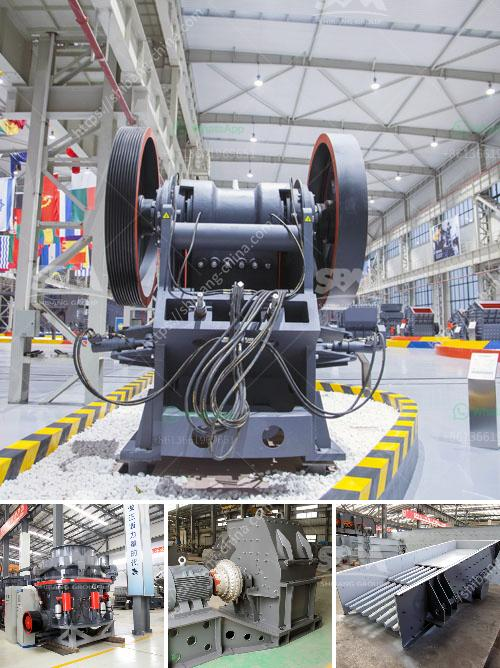

<h3>ball clay crusher manufacturing process</h3>
Ball clay is a type of sedimentary clay that is commonly used in the ceramics industry. It is often added to porcelain, china, and earthenware to enhance their strength, elasticity, and workability. To produce ball clay, it needs to go through a crusher process in which the clay is mixed with water and crushed into smaller particles.

The manufacturing process of a ball clay crusher is relatively simple. The raw material is first extracted from the earth and then transported to the crusher for further processing. In the crusher, the clay is mixed with water to create a slurry-like consistency. This slurry is then fed into a series of rotating crushers, which grind the clay into smaller particles.

During the crushing process, the water helps to lubricate the crushers and reduce the heat generated from friction. It also helps to control the size of the particles and ensure a consistent product. After the clay is crushed, it is usually screened to remove any impurities or larger particles.

Once the clay has been crushed and screened, it is ready to be used in the ceramics industry. It can be shaped into various forms, such as tiles, bowls, or vases, and then fired in a kiln to harden and strengthen the clay. The finished product is a durable and versatile material that is widely used in the production of ceramics.

In summary, the manufacturing process of a ball clay crusher involves extracting the raw material from the earth, crushing it into smaller particles, and then screening it to remove impurities. The resulting clay is then ready to be shaped and fired into various ceramic products. This process ensures a consistent and high-quality clay that is essential for the ceramics industry.
<h3>Contact us</h3><ul><li><strong>Whatsapp:&nbsp;<a href="https://wa.me/8613661969651">+8613661969651</a></strong></li><li><a href="https://swt.shibang-china.com/?git&amp;zhl&amp;ball clay crusher manufacturing process"><strong>Online Service(chat now)</strong></a></li></ul><h3>Related</h3><ul><li><a href='gold mill equipment zimbabwe.md'>gold mill equipment zimbabwe</a></li><li><a href='low productivity jaw crusher.md'>low productivity jaw crusher</a></li><li><a href='used portable crusher for sale south africa.md'>used portable crusher for sale south africa</a></li><li><a href='clinker grinding plant setup cost in india.md'>clinker grinding plant setup cost in india</a></li><li><a href='kaolin powder machine.md'>kaolin powder machine</a></li></ul>