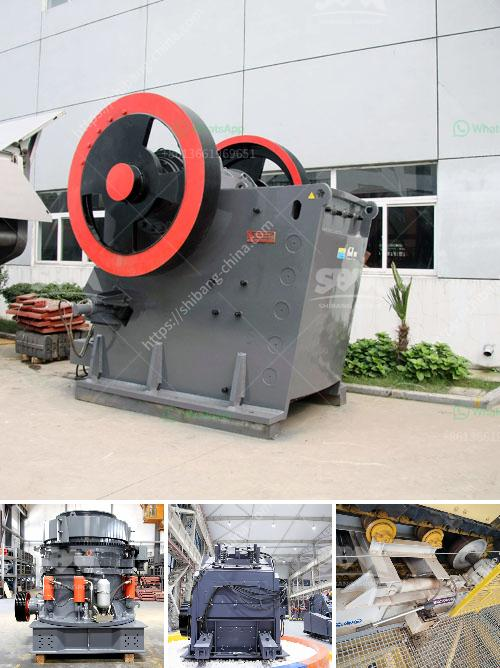

<h3>ball miling for lime stone</h3>
Ball milling for limestone is a mechanical process that aims to reduce the particle size of calcium carbonate. Ball mills are used to grind and mix the materials, enhancing reaction rates. The process involves using limestone as a raw material and placing it into a mill, then rotating the mill to grind the limestone. The milling process produces a fine powder that is used in various industries like construction, agriculture, and more.

One of the key benefits of ball milling for limestone is its ability to produce a high-quality product. The process ensures a uniform particle size distribution, resulting in a fine powder that is ideal for many applications. This consistency is crucial for industries that require precise control over the particle size, such as building materials or pharmaceuticals.

Another advantage of ball milling is its efficiency in energy consumption. The process utilizes the kinetic energy of the rotating mill, minimizing the need for additional energy inputs. This energy efficiency makes ball milling for limestone a cost-effective solution for industries looking to grind and mix materials.

Furthermore, ball milling allows for the customization of the final product. Adjustable parameters during the process, such as the milling time and speed, enable manufacturers to achieve the desired particle size and distribution. This versatility makes ball milling an attractive option for industries that require flexibility in their production processes.

Ball milling for limestone is a widely used technique due to its versatility and efficiency. It offers businesses in various sectors a reliable method to produce high-quality, finely ground limestone powder. Whether it is used in the construction industry for producing cement or in agriculture for neutralizing soil pH, ball milling provides a viable solution for processing limestone.
<h3>Contact us</h3><ul><li><strong>Whatsapp:&nbsp;<a href="https://wa.me/8613661969651">+8613661969651</a></strong></li><li><a href="https://swt.shibang-china.com/?git&amp;zhl&amp;ball miling for lime stone"><strong>Online Service(chat now)</strong></a></li></ul><h3>Related</h3><ul><li><a href='china henan machinery small ball mill.md'>china henan machinery small ball mill</a></li><li><a href='calcium carbonate crusher.md'>calcium carbonate crusher</a></li><li><a href='used stone crushers for sale in accra.md'>used stone crushers for sale in accra</a></li><li><a href='manufacturer of portable floatation plant in china.md'>manufacturer of portable floatation plant in china</a></li><li><a href='stone crusher in cameroon.md'>stone crusher in cameroon</a></li></ul>