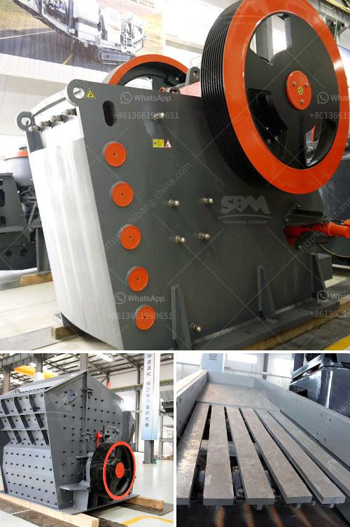

<h3>ball mill 5 tonnes</h3>
In today's world, natural resources are becoming increasingly scarce, and the need to find sustainable alternatives is paramount. Ball mill technology, a dependable and durable staple in the mining and ore processing industry, has been recalibrated to handle heavier loads.

A ball mill is a piece of grinding equipment that grinds materials into fine powder in a cylindrical chamber. The mill is loaded with grinding media like steel or chrome balls, the grinding balls crush the material into powder.

The mill rotates continuously, grinding materials from the crushed ore. The powder is discharged through the discharge grate to complete the grinding operation. Ball mills are characterized by their low power consumption and high production efficiency.

A ball mill 5 tonnes is capable of processing more tons per hour compared to other mills, such as the stamp mill or roller mill. Its benefits encompass productivity, longevity, and lower operational costs. By investing in a large-capacity ball mill, companies can save significant amounts of energy and electrical consumption over the same period.

One of the major advantages of using a ball mill 5 tonnes is its adaptability to different materials. Different types of grinding media, such as stainless steel balls or ceramic balls, can be used to change the grinding effect according to the hardness and chemical properties of the material being processed.

Moreover, the ball mill 5 tonnes can be used to crush and grind materials with a hardness of up to 6 on the Mohs scale. This ensures that a wide range of materials, from limestone to hard rocks, can be processed efficiently and effectively. The versatility of the ball mill technology not only enhances productivity but also opens doors to various applications in multiple industries.

Furthermore, the larger capacity of the ball mill 5 tonnes means that fewer machines are required to fulfill the production target. This reduces the space required for installation, resulting in more compact processing plants that are easier to operate and maintain.

However, it is crucial to note that the ball mill 5 tonnes requires proper maintenance to ensure its efficient and sustainable operation. Regular inspection and maintenance of the mill, along with proper lubrication, can prolong its lifespan significantly. This not only saves costs associated with repair or replacement but also reduces the environmental impact of discarding worn-out machinery.

In conclusion, the ball mill 5 tonnes is a remarkable piece of technology that has revolutionized the mining and ore processing industry. It offers numerous benefits, including increased productivity, adaptability to different materials, and reduced energy consumption. Investing in a ball mill 5 tonnes is a step towards more sustainable processing, as it allows for better resource management and contributes to a greener future.
<h3>Contact us</h3><ul><li><strong>Whatsapp:&nbsp;<a href="https://wa.me/8613661969651">+8613661969651</a></strong></li><li><a href="https://swt.shibang-china.com/?git&amp;zhl&amp;ball mill 5 tonnes"><strong>Online Service(chat now)</strong></a></li></ul><h3>Related</h3><ul><li><a href='chrome lead ore vsi crusher manufacturer.md'>chrome lead ore vsi crusher manufacturer</a></li><li><a href='cone crushers for sale.md'>cone crushers for sale</a></li><li><a href='manufacturer of stone crusher.md'>manufacturer of stone crusher</a></li><li><a href='china coal washing plant.md'>china coal washing plant</a></li><li><a href='singapore mining conveyor belt supplier.md'>singapore mining conveyor belt supplier</a></li></ul>