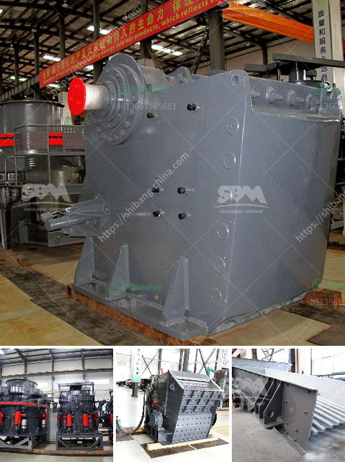

<h3>ball mill 800 ton day</h3>
The ball mill is a type of grinding mill used to grind materials into extremely fine powder for use in mineral dressing processes, paints, pyrotechnics, ceramics and selective laser sintering. It works on the principle of impact and attrition: size reduction is done by impact as the balls drop from near the top of the shell. A ball mill consists of a hollow cylindrical shell rotating about its axis. The axis of the shell may be either horizontal or at a small angle to the horizontal. It is partially filled with balls. The grinding media is the balls, which may be made of steel (chrome steel), stainless steel, ceramic, or rubber.

The ball mill is a key piece of equipment for grinding crushed materials, and it is widely used in production lines for powders such as cement, silicates, refractory material, fertilizer, glass ceramics, etc. as well as for ore dressing of both ferrous and non-ferrous metals. The ball mill can grind various ores and other materials either wet or dry.

With an efficient grinding system, the capacity of the ball mill can be increased by 800 tons per day. This means that the ball mill can operate smoothly for more hours, providing more grinding output during every shift. As a result, the overall efficiency and productivity of the ball mill circuit is improved. This boost in productivity can lead to significant cost savings for the mining industry.

One key factor in increasing the ball mill's capacity is to optimize the grinding media ratio. The grinding media ratio refers to the ratio of the weight of the grinding balls to the weight of the ore particles in the mill. Optimal grinding media ratio results in efficient grinding and reduces the energy consumption. By adjusting the grinding media ratio and the feed rate of material, the desired particle size and fineness can be achieved, leading to higher production rates.

Moreover, using high-quality grinding balls made from durable materials can prolong the lifespan of the ball mill and reduce maintenance costs. Grinding balls with high hardness and impact resistance can withstand the abrasive environment inside the ball mill, resulting in longer service life and fewer replacements. This reduces downtime and maintenance expenses, contributing to the increase in overall production.

Additionally, employing advanced control systems such as automatic ball charging and monitoring systems can enhance the performance of the ball mill. These systems precisely control the feed rate and optimize the grinding process. Automatic ball charging systems ensure a consistent supply of grinding media, avoiding disruptions in the grinding process. Monitoring systems help identify potential issues and allow for prompt intervention, preventing damage to the mill and reducing downtime.

In conclusion, the ball mill plays a crucial role in the mining industry as an efficient grinding tool. Increasing its capacity to 800 tons per day through various optimizations and improvements can lead to significant cost savings, higher productivity, and longer equipment life. These advancements help mining companies operate more efficiently and economically, ensuring a sustainable and profitable operation.
<h3>Contact us</h3><ul><li><strong>Whatsapp:&nbsp;<a href="https://wa.me/8613661969651">+8613661969651</a></strong></li><li><a href="https://swt.shibang-china.com/?git&amp;zhl&amp;ball mill 800 ton day"><strong>Online Service(chat now)</strong></a></li></ul><h3>Related</h3><ul><li><a href='mining process of marble.md'>mining process of marble</a></li><li><a href='nigeria minerals crusher processing company.md'>nigeria minerals crusher processing company</a></li><li><a href='jaw crusher global machines sweden ab.md'>jaw crusher global machines sweden ab</a></li><li><a href='complete gold mining equipment for small scale mines.md'>complete gold mining equipment for small scale mines</a></li><li><a href='marble stone grinder mill.md'>marble stone grinder mill</a></li></ul>