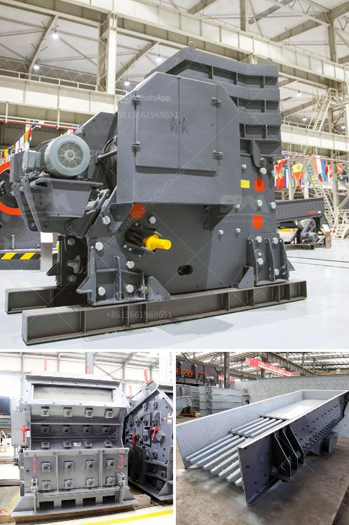

<h3>ball mill ball mill</h3>
The ball mill is a key equipment for grinding materials, widely used in powder-making production line such as cement, silicate sand, new-type building material, refractory material, fertilizer, ore dressing of ferrous metal and non-ferrous metal, glass ceramics, etc. Ball mill can grind various ores and materials with dry type or wet type. There are two kinds of ball mills, grate type and overfall type due to different ways of discharging material.

A ball mill consists of a hollow cylindrical shell rotating about its axis. The axis of the shell may be either horizontal or at a small angle to the horizontal. It is partially filled with balls. The grinding media is the balls, which may be made of steel (chrome steel), stainless steel, ceramic, or rubber. The inner surface of the cylindrical shell is usually lined with an abrasion-resistant material such as manganese steel or rubber. The length of the mill is approximately equal to its diameter.

The ball mill is a tumbling mill that uses steel balls as the grinding media. The length of the cylindrical shell is usually 1–1.5 times the shell diameter (Figure 1). The feed can be dry, with less than 3% moisture to minimize ball coating, or slurry containing 20–40% water by weight.

The grinding media are the balls, which may be made of steel (chrome steel), stainless steel, ceramic, or rubber. The inner surface of the cylindrical shell is usually lined with an abrasion-resistant material such as manganese steel or rubber. The balls occupy about 30 to 50 percent of the volume of the mill. The diameter of ball used will vary between 12 mm and 125 mm.

Ball mills are characterized by their smaller (comparatively) diameter and longer length, and often have a length 1.5 to 2.5 times the diameter. The feed is at one end of the cylinder and the discharge is at the other. Small versions of ball mills can be found in laboratories where they are used for grinding sample material for quality assurance.

where E is the energy input, W is the work input, P80 is the 80% passing size of the product, and F80 is the 80% passing size of the feed. When the work input is proportional to the new surface area produced, it has been found that a steady-state condition can be achieved by accurately modeling the grinding environment.-

In recent years, the popularity of the ball mill has increased due to its ability to grind a wide range of materials while consuming less energy. In addition, the ball mill is easy to maintain and durable enough to withstand long-term use. The versatility of the ball mill allows it to be used for many different purposes, such as grinding, mixing, and blending of materials.

In conclusion, the ball mill is a reliable and efficient tool for grinding materials into fine powders. It is widely used in different industries, including mining, cement, chemistry, and construction. In addition, the ball mill has a variety of advantages over other types of mills, such as high grinding efficiency, low power consumption, and a low investment cost. With its numerous benefits, it is no wonder that the ball mill is highly sought after by clients in various industries.
<h3>Contact us</h3><ul><li><strong>Whatsapp:&nbsp;<a href="https://wa.me/8613661969651">+8613661969651</a></strong></li><li><a href="https://swt.shibang-china.com/?git&amp;zhl&amp;ball mill ball mill"><strong>Online Service(chat now)</strong></a></li></ul><h3>Related</h3><ul><li><a href='method statement for a barite mill.md'>method statement for a barite mill</a></li><li><a href='jaw roll crusher.md'>jaw roll crusher</a></li><li><a href='feldspar crusher cost.md'>feldspar crusher cost</a></li><li><a href='used iron ore impact crusher for hire.md'>used iron ore impact crusher for hire</a></li><li><a href='mini cement plants manufacturer africa.md'>mini cement plants manufacturer africa</a></li></ul>