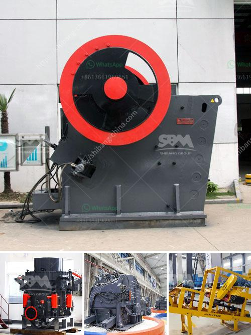

<h3>ball mill bekas surabayajn</h3>
Ball mill machine is the key equipment for grinding and blending materials. The machine is widely used in various industrial sectors to grind raw materials into powder form. The machine is widely used in ceramic industry, cement industry, paint industry, and many more. It is also used in the pharmaceutical industry to grind materials into a fine powder for further use.

Surabaya, the second-largest city in Indonesia, is known for its industrial sector. Many industries in Surabaya require ball mill machines for various purposes. These machines are an integral part of their manufacturing processes, ensuring efficient and effective production.

A ball mill is essentially a large cylinder filled with steel balls. The grinding media, as they are called, crush and grind the material within the mill, effectively reducing the size of particles. The rotation of the cylinder causes the grinding media to cascade, creating a cascading effect that efficiently grinds the material.

For industries in Surabaya that require ball mill machines, purchasing a new machine might not always be a viable option due to budget constraints. In such cases, companies often opt for used or second-hand ball mill machines. This is where ball mill bekas Surabaya comes into play.

Ball mill bekas Surabaya refers to used ball mill machines that are offered for sale or rent in Surabaya. These machines have been previously owned and used by other companies or individuals. They offer a cost-effective alternative to purchasing a new machine, allowing manufacturing industries to save money without compromising on the quality of their products.

One of the primary advantages of ball mill bekas Surabaya is its affordability. These used machines are available at a fraction of the cost of new machines, making them an attractive option for companies with limited budgets. By investing in a used ball mill machine, companies can allocate their funds to other areas of production or expansion.

However, it is crucial to exercise caution when purchasing a used ball mill machine. It is essential to inspect the machine thoroughly and ensure that it is in good working condition. This includes checking the motor, gears, and other crucial components of the machine. Additionally, it is advisable to seek information about the machine's previous usage, including the types of materials it has processed and the maintenance history.

To conclude, ball mill bekas Surabaya offers manufacturing industries in Surabaya a cost-effective solution for grinding and blending materials. These used machines allow companies to save money without compromising on the quality of their products. However, it is crucial to perform a thorough inspection and gather information about the machine's previous usage before investing in a used ball mill machine. Through proper due diligence, companies can find reliable and efficient used ball mill machines that meet their production needs and budget constraints.
<h3>Contact us</h3><ul><li><strong>Whatsapp:&nbsp;<a href="https://wa.me/8613661969651">+8613661969651</a></strong></li><li><a href="https://swt.shibang-china.com/?git&amp;zhl&amp;ball mill bekas surabayajn"><strong>Online Service(chat now)</strong></a></li></ul><h3>Related</h3><ul><li><a href='mobile stone crushing machine.md'>mobile stone crushing machine</a></li><li><a href='continuous ball mill capacity 500 hr.md'>continuous ball mill capacity 500 hr</a></li><li><a href='contact address puzzolana cone crusher.md'>contact address puzzolana cone crusher</a></li><li><a href='functions of the part of a hammer mill.md'>functions of the part of a hammer mill</a></li><li><a href='stone crush plant 4tph.md'>stone crush plant 4tph</a></li></ul>