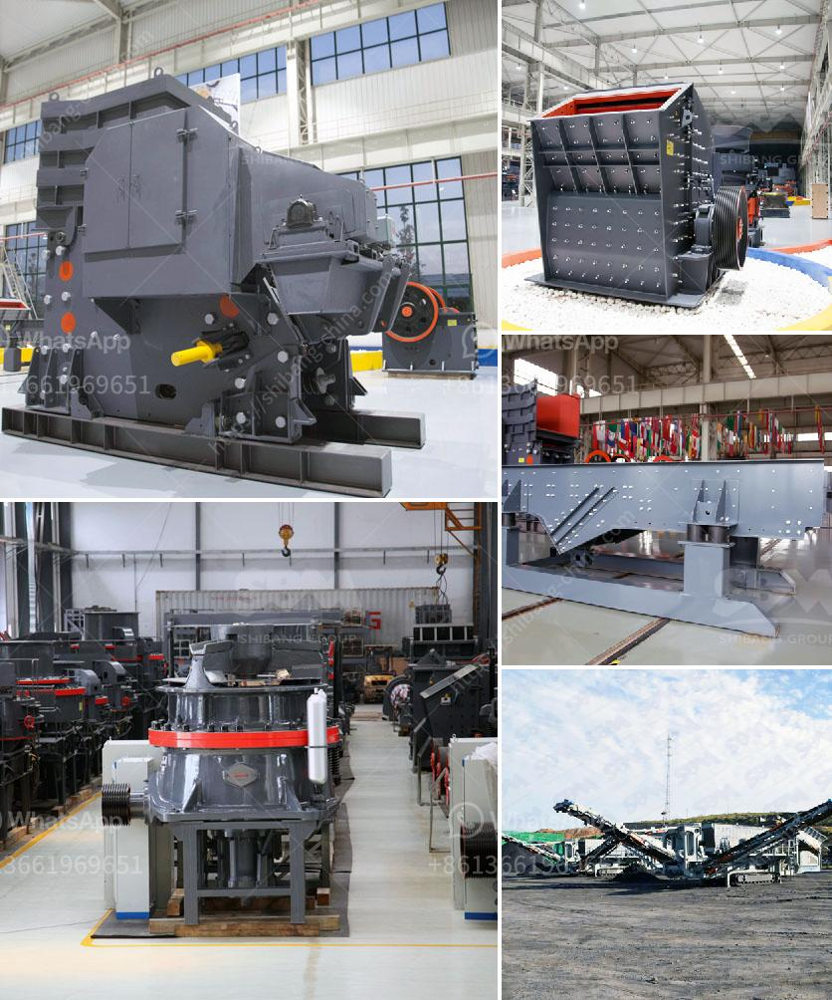

<h3>ball mill calcium</h3>
Ball mill calcium, also known as limestone, is a common mineral found in rock formations such as marble and limestone. Calcium carbonate derived from these sources is usually used as a filler in many industries, including construction, agriculture, pharmaceuticals, and paper. The main component, calcium carbonate, has various uses depending on its particle size and purity.

One method of producing calcium carbonate is through the use of ball mills. A ball mill is a type of grinder used to grind and blend materials for use in mineral dressing processes, paints, pyrotechnics, ceramics, and selective laser sintering. It works on the principle of impact and attrition: size reduction is done by impact as the balls drop from near the top of the shell.

In the case of ball mill calcium, the raw material is calcium carbonate rock which is grinded to the desired particle size by the ball mill. This calcium carbonate rock is then further purified through multiple processes to meet the required specifications.

The use of ball mill calcium has a wide range of applications. In the construction industry, it is used as a filler in coatings and adhesives, providing toughness, durability, and resistance to weathering. It is also used as a raw material in the manufacturing of cement and concrete, enhancing their strength and performance.

In the agricultural sector, ball mill calcium is used to improve soil quality. It neutralizes acidic soils by raising the pH levels, making them more suitable for growing crops. Additionally, it is used as a nutrient supplement in animal feed to promote healthy bone development and improve eggshell quality in poultry.

The pharmaceutical industry utilizes ball mill calcium in the production of calcium tablets and antacids. Calcium carbonate supplements are commonly prescribed to prevent and treat calcium deficiencies. The ball mill calcium ensures the purity and uniformity of the calcium carbonate used in these medications.

Paper manufacturers also rely on ball mill calcium as a filler in the production of paper products. It enhances the paper's brightness, opacity, and smoothness, resulting in high-quality prints and reduced ink absorption.

As with any industrial process, the quality of ball mill calcium is crucial. Impurities and variations in particle size can affect the performance and usability of the end product. Therefore, strict quality control measures are implemented during the production process to ensure consistent and high-quality calcium carbonate.

In conclusion, ball mill calcium is a versatile mineral with numerous applications in various industries. Its uses range from construction and agriculture to pharmaceuticals and paper manufacturing. The ball mill process ensures the production of high-quality calcium carbonate, which meets the required specifications for each industry. As research and technology continue to advance, the utilization of ball mill calcium is expected to further expand, providing more innovative solutions for different sectors.
<h3>Contact us</h3><ul><li><strong>Whatsapp:&nbsp;<a href="https://wa.me/8613661969651">+8613661969651</a></strong></li><li><a href="https://swt.shibang-china.com/?git&amp;zhl&amp;ball mill calcium"><strong>Online Service(chat now)</strong></a></li></ul><h3>Related</h3><ul><li><a href='stone transport belt conveyor.md'>stone transport belt conveyor</a></li><li><a href='second hand mobile crushers and screens south africa.md'>second hand mobile crushers and screens south africa</a></li><li><a href='ethiopia gypsum machinery supplier.md'>ethiopia gypsum machinery supplier</a></li><li><a href='ore grinding mills china.md'>ore grinding mills china</a></li><li><a href='rock crusher machine price in india.md'>rock crusher machine price in india</a></li></ul>