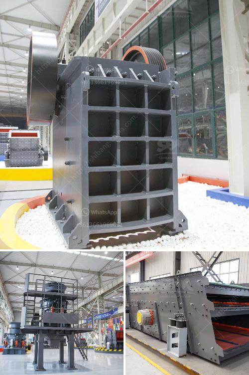

<h3>ball mill capacity how to calculate</h3>
Ball mill is widely used in mineral processing, building materials, metallurgy, cement, glass, chemical and other fields. It has good grinding effect for gold ore, iron ore, molybdenum ore, glass, quartz stone and silicate products. It is one of the most popular equipment in the industry.

How to calculate the ball mill capacity? As a leading global manufacturer of crushing, grinding and mining equipment, we offer advanced, reasonable solutions for any size-reduction requirements including quarry, aggregate, and different kinds of minerals.

C = (350 * d^2) / d, where c is the capacity of the ball mill and d is the diameter of the ball mill.

Different ball mills have different ball loading capacity, which can be calculated according to the grinding medium load calculation formula.

The grinding balls have better quality, uniform particle size and good wear resistance, and the overall efficiency of the ball mill is improved.

The lining plate and grinding medium of ball mill are made of non-metallic wear-resistant materials, which improves the grinding ability and prolongs the service life of the equipment.

In order to increase the effective volume of the ball mill, a corrugated lining plate is arranged on the inner wall of the mill barrel, so that the lining plate and the grinding medium form a spiral trajectory, improving the grinding ability of the ball mill. At the same time, the combined action of the grinding medium and the lining plate forms the cascading and falling impact grinding effect, enhancing the grinding efficiency.

In addition, the ball mill adopts the design of centralized oil lubrication, which greatly reduces the friction loss of the gear, prolongs the service life of the equipment, and reduces the maintenance workload.

In conclusion, calculating the ball mill capacity is based on the mill diameter and the ball loading capacity. The reasonable ball loading capacity can achieve higher grinding efficiency and ultimately enhance the production capacity of the ball mill. It is essential to understand the material properties, hardness, grindability and the specific gravity before selecting the materials used for liners and grinding balls. A detailed calculation should be conducted to ensure the ball mill's efficient grinding performance.
<h3>Contact us</h3><ul><li><strong>Whatsapp:&nbsp;<a href="https://wa.me/8613661969651">+8613661969651</a></strong></li><li><a href="https://swt.shibang-china.com/?git&amp;zhl&amp;ball mill capacity how to calculate"><strong>Online Service(chat now)</strong></a></li></ul><h3>Related</h3><ul><li><a href='stone crushers in bennta in bogota.md'>stone crushers in bennta in bogota</a></li><li><a href='price of zenithcrusher plant.md'>price of zenithcrusher plant</a></li><li><a href='gold mining equipment washing machines.md'>gold mining equipment washing machines</a></li><li><a href='used complete tantalum processing plant for sale.md'>used complete tantalum processing plant for sale</a></li><li><a href='suppliers of ball mill in bhopal.md'>suppliers of ball mill in bhopal</a></li></ul>