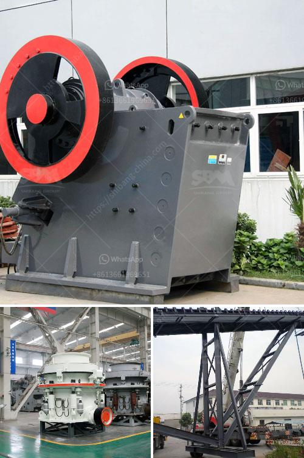

<h3>ball mill for limestone</h3>
A ball mill for limestone is a type of grinder used to grind and blend materials for use in mineral dressing processes, paints, pyrotechnics, ceramics, and selective laser sintering. It works on the principle of impact and attrition: size reduction is done by impact as the balls drop from near the top of the shell. 

A ball mill consists of a hollow cylindrical shell rotating about its axis. The axis of the shell may be either horizontal or at a small angle to the horizontal. It is partially filled with balls. The grinding media are the balls, which may be made of steel, stainless steel, ceramic, or rubber. The inner surface of the cylindrical shell is usually lined with an abrasion-resistant material such as manganese steel or rubber.

The ball mill is a key piece of equipment for grinding crushed materials, and it is widely used in production lines for powders such as cement, silicates, refractory material, fertilizer, glass ceramics, etc., as well as for ore dressing of ferrous and non-ferrous metals. The ball mill can grind ores and other materials, wet or dry. There are two kinds of ball mills according to their ways of discharging material: grate type, and overfall type.

One of the most important features of a ball mill is its large capacity. It can process a large amount of material at once, which gives it a greater efficiency over other grinding methods. The fineness of the finished product can also be adjusted by controlling the speed of rotation and the duration of the milling process.

In the case of limestone, a ball mill is the most suitable grinding machine because the limestone is not heat-sensitive and is easily ground by impact and attrition. The ball mill is also capable of making a wide range of particle sizes. This means that the particle size distribution can be successfully controlled by optimizing the grinding conditions such as rotation speed and duration.

Moreover, the ball mill for limestone can be used to grind almost all kinds of minerals with different nature and hardness. It can grind limestone, gypsum, quartz, sand, gold, iron ore, copper ore, marble, cement, and more. With the continuous improvement of technology, the ball mill in limestone grinding industry has also made great advancements.

In conclusion, a ball mill for limestone grinding is a highly versatile and robust tool which offers a wide range of benefits for businesses. It is suitable for grinding limestone, gypsum, cement, quartz, etc., as well as other mineral materials. The ball mill has a great reputation in the limestone grinding industry, and its performance and efficiency have been proven by extensive applications.
<h3>Contact us</h3><ul><li><strong>Whatsapp:&nbsp;<a href="https://wa.me/8613661969651">+8613661969651</a></strong></li><li><a href="https://swt.shibang-china.com/?git&amp;zhl&amp;ball mill for limestone"><strong>Online Service(chat now)</strong></a></li></ul><h3>Related</h3><ul><li><a href='materials hammer mill.md'>materials hammer mill</a></li><li><a href='used jaw mobile crusher in uae.md'>used jaw mobile crusher in uae</a></li><li><a href='philippines crusher equipment.md'>philippines crusher equipment</a></li><li><a href='aggregate quarry crusher philippines.md'>aggregate quarry crusher philippines</a></li><li><a href='belt conveyor design.md'>belt conveyor design</a></li></ul>