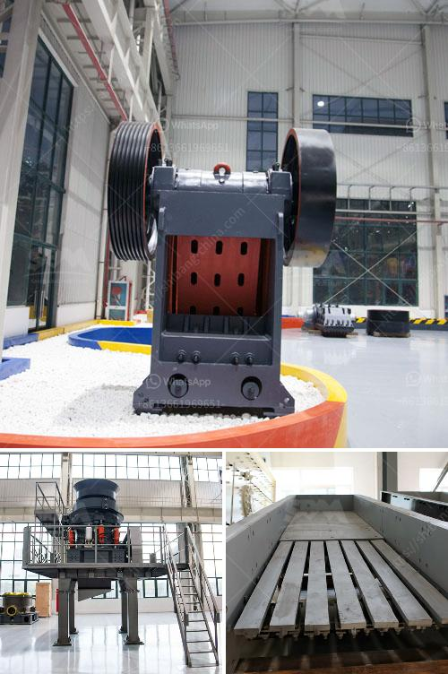

<h3>ball mill for sale cagayan</h3>
Cagayan, a province in the Northern Philippines, is known for its stunning natural beauty. From pristine beaches to majestic waterfalls, it offers a haven for nature enthusiasts. However, this province not only boasts of natural wonders but also thrives economically. One of the industries that contribute to Cagayan's economic growth is mining.

Mining in Cagayan primarily revolves around extracting minerals such as gold and magnetite sand. These minerals go through a series of processes to become valuable commodities. One essential piece of equipment used in the mining industry is the ball mill. This equipment is used to grind and crush material into smaller particles. It plays a vital role in the extraction of minerals, making it a valuable asset for mining companies.

Finding a reliable and high-quality ball mill for sale in Cagayan is crucial for mining companies. This equipment needs to be robust, efficient, and capable of handling various types of ore. Fortunately, there are specialized suppliers and manufacturers who provide ball mills designed specifically for the mining industry.

Investing in a top-of-the-line ball mill ensures that mining companies in Cagayan can maximize their productivity and increase their mineral extraction output. Additionally, a high-quality ball mill helps to reduce downtime and maintenance costs, allowing for greater profitability.

When searching for a ball mill for sale in Cagayan, mining companies should consider several factors. These include the reputation of the supplier or manufacturer, the quality of the equipment, and the aftersales service provided. It's essential to choose a reputable supplier who understands the specific needs and requirements of the mining industry.

Investing in a high-quality ball mill is a long-term investment that can significantly impact a company's mining operations. Therefore, mining companies in Cagayan should carefully evaluate their options and choose a ball mill that fits their needs and budget.

In conclusion, the ball mill is a vital piece of equipment in the mining industry. Cagayan, with its rich mineral resources, can greatly benefit from investing in high-quality ball mills. By choosing reliable suppliers and manufacturers, mining companies can maximize their productivity, efficiency, and profitability.
<h3>Contact us</h3><ul><li><strong>Whatsapp:&nbsp;<a href="https://wa.me/8613661969651">+8613661969651</a></strong></li><li><a href="https://swt.shibang-china.com/?git&amp;zhl&amp;ball mill for sale cagayan"><strong>Online Service(chat now)</strong></a></li></ul><h3>Related</h3><ul><li><a href='carbon black processing machine in delhi.md'>carbon black processing machine in delhi</a></li><li><a href='stone jaw crusher for rock crushing.md'>stone jaw crusher for rock crushing</a></li><li><a href='trackmounted equipment.md'>track-mounted equipment</a></li><li><a href='mica powder manufacturers machinery.md'>mica powder manufacturers machinery</a></li><li><a href='river stone crushing plant for sale.md'>river stone crushing plant for sale</a></li></ul>