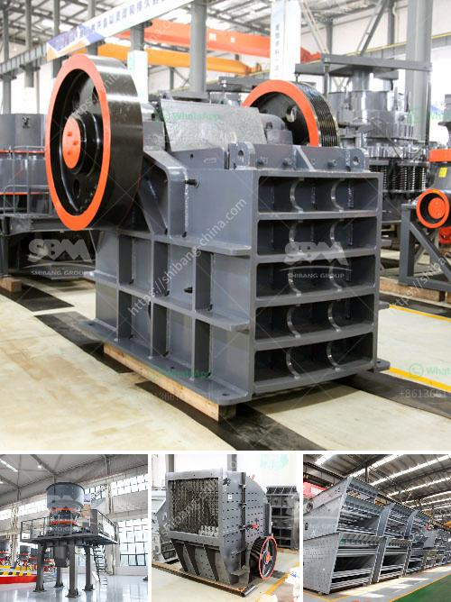

<h3>ball mill for starch damage</h3>
Starch, derived from various sources such as maize, wheat, and potatoes, is a vital component widely used in numerous industries, including food, pharmaceuticals, textile, and paper. To produce high-quality starch, it is crucial to minimize starch damage during the processing stage. One indispensable equipment extensively utilized for this purpose is the ball mill.

A ball mill is a type of grinder that is used to grind, blend, and sometimes for mixing of materials for use in various applications. In the starch processing industry, the ball mill plays a significant role in refining the starch particles prior to the starch isolation process. The initial step involves soaking the raw starch source in water, followed by grinding in a ball mill to break down the starch granules into smaller particles.

One of the essential goals in starch processing is to minimize starch damage. Starch damage refers to the detrimental effect on the quality and functionality of starch caused by excessive heat and mechanical shear. When the starch granules are subjected to such forces, the structural integrity of the granules can be disrupted, leading to damaged starch.

The ball mill is crucial in minimizing starch damage due to its unique design and functionality. The mill operates by rotating a cylinder with steel balls inside, generating significant mechanical shear forces. This action breaks down the starch granules into smaller particles without inducing excessive heat, safeguarding the integrity of the starch molecules.

Moreover, the ball mill provides control over the particle size distribution of the starch. By adjusting the milling time and speed, the desired particle size can be achieved, ensuring the starch meets the specifications required for the intended application. This control is essential as different industries require starch with specific properties such as viscosity, gelatinization, and solubility.

In addition to minimizing starch damage, the ball mill offers other advantages in starch processing. The presence of steel balls in the mill promotes efficient mixing and uniform dispersion of water in the starch slurry. This assists in achieving even hydration of the starch particles, leading to improved starch gelatinization during subsequent processes.

Furthermore, the ball mill facilitates the removal of impurities during the starch isolation process. By subjecting the starch slurry to mechanical shear, undesired components such as proteins, fibers, and lipids can be loosened and subsequently separated, resulting in purer starch.

In conclusion, the ball mill for starch damage is an indispensable equipment in starch processing. Its ability to provide control over particle size distribution, minimize starch damage, and promote efficient mixing makes it a key component in the production of high-quality starch with desirable functional properties. By utilizing a ball mill in starch processing, manufacturers can ensure the consistent and efficient production of starch for a myriad of applications.
<h3>Contact us</h3><ul><li><strong>Whatsapp:&nbsp;<a href="https://wa.me/8613661969651">+8613661969651</a></strong></li><li><a href="https://swt.shibang-china.com/?git&amp;zhl&amp;ball mill for starch damage"><strong>Online Service(chat now)</strong></a></li></ul><h3>Related</h3><ul><li><a href='gold refinery in philippines south africa.md'>gold refinery in philippines south africa</a></li><li><a href='difference between ball mill and roller mill.md'>difference between ball mill and roller mill</a></li><li><a href='vibrating screens pictures.md'>vibrating screens pictures</a></li><li><a href='gold crusher machine.md'>gold crusher machine</a></li><li><a href='stone crusher trading company.md'>stone crusher trading company</a></li></ul>