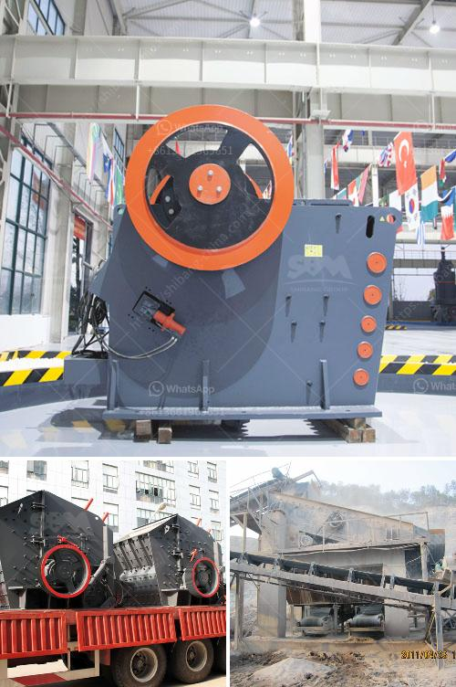

<h3>ball mill grinder canada</h3>
Ball mills have been used throughout the world for a long time but more than ever the need to grind minerals to ultrafine sizes is becoming increasingly important. With the focus on providing a cost-effective solution for industrial size reduction projects, many manufacturers are now turning to ball mill grinder Canada to assist them in meeting their grinding needs.

Canada is known for its vast resources of minerals, and the mining industry plays a significant role in the country's economy. To extract valuable minerals from the ore, a grinding process is necessary. The traditional method of grinding involves using large industrial mills, which are not only expensive but also consume an enormous amount of energy.

The advent of ball mill grinder Canada has opened up new possibilities for extracting valuable minerals from low-grade ores at a much lower cost. This technology involves using a small and lightweight rotating chamber filled with steel or ceramic balls to continuously grind the ore into fine particles. Compared to traditional methods, ball mill grinder Canada significantly reduces the energy consumption and operating costs, resulting in substantial savings for mining companies.

One of the key advantages of using ball mill grinder Canada is its ability to produce a product with a narrow particle size distribution. This is critical, especially in industries such as cement, where consistent particle size is crucial for optimal performance. The fine grinding capability of ball mill grinders allows for the production of ultra-fine particles, which can enhance the final properties of various materials.

In addition to its cost-effectiveness and ability to produce high-quality products, ball mill grinder Canada also offers excellent control over the grinding process. The speed, direction, and duration of the rotation can be adjusted to achieve the desired fineness and material properties. This level of control ensures that the final product meets the specific requirements of the industry, such as the desired particle size, chemical composition, and surface area.

Furthermore, ball mill grinder Canada is highly versatile, capable of grinding a wide range of materials, including minerals, ceramics, chemicals, and even food products. This versatility makes it an attractive option for industries seeking to diversify their product portfolio or explore new applications.

The implementation of ball mill grinder technology is not limited to Canada alone. Manufacturers worldwide are recognizing the advantages and embracing this grinding method. As a result, a global network of ball mill grinder suppliers and experts has emerged, offering support, services, and the latest advancements in this field.

In conclusion, ball mill grinder Canada is revolutionizing the way minerals are ground, offering a cost-effective, energy-efficient, and precise grinding method. With its ability to produce ultra-fine particles and its versatility across various industries, this technology is set to drive advancements in industrial size reduction projects. As the global demand for ultrafine grinding continues to grow, ball mill grinder Canada remains at the forefront, providing reliable and innovative solutions for the mining industry and beyond.
<h3>Contact us</h3><ul><li><strong>Whatsapp:&nbsp;<a href="https://wa.me/8613661969651">+8613661969651</a></strong></li><li><a href="https://swt.shibang-china.com/?git&amp;zhl&amp;ball mill grinder canada"><strong>Online Service(chat now)</strong></a></li></ul><h3>Related</h3><ul><li><a href='catalog of stone crusher production line made in iran.md'>catalog of stone crusher production line made in iran</a></li><li><a href='price of stone crush machine in pakistan.md'>price of stone crush machine in pakistan</a></li><li><a href='process of river rock crushing to make cement.md'>process of river rock crushing to make cement</a></li><li><a href='cone crusher for salae used.md'>cone crusher for salae used</a></li><li><a href='komatsu br 380 crusher for sale in malaysia.md'>komatsu br 380 crusher for sale in malaysia</a></li></ul>