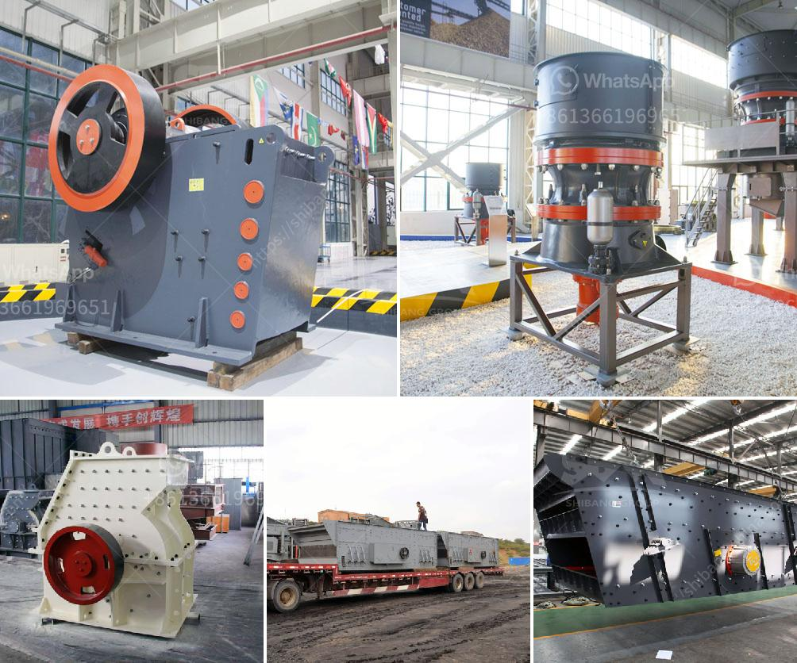

<h3>ball mill grinding manufacturer in india</h3>
Ball mill is extensively utilized in cement industry, mining industry, building material, chemical industry etc. There are two ways of grinding: the dry process and the wet process. It can be divided into tabular type and flowing type according to different forms of discharging material.

Ball mills have a variety of applications in both industrial and personal use. From being a part of the grinding process in mining operations to helping grind down materials after chemical processes, these powerful machines are an integral part of numerous industries. 

In India, ball mill grinding manufacturers offer high quality and performance ball mill grinding units. They cater to diverse requirements in mining, cement plant, power plant, and processing industries. These manufacturers also provide optimum grinding solutions to diverse industries with their advanced technology and highly experienced engineers. 

One of the leading ball mill grinding manufacturers in India is Promas Engineers. Promas Engineers supply high performance ball mills for mineral processing, cement plants, and metal mines. Their high efficiency ball mills have been sold in India and other countries, making them popular choices for grinding operations. 

Promas Engineers provide comprehensive technical support, including engineering design, grinding media selection, and manufacturing of high-quality grinding media. They have a strong R&D team and advanced equipment, enabling them to offer customized solutions for various industries. 

Another renowned ball mill grinding manufacturer in India is Techno Designs. Techno Designs is a leading manufacturer and supplier of industrial machinery and equipment, including ball mills. With their extensive experience in the field of grinding equipment, they are able to deliver high quality products and excellent customer service. 

Their ball mills are widely used in various industries such as mineral processing, metallurgy, chemical, power, cement, and construction. They continuously strive to improve the efficiency and performance of their ball mills, making them the preferred choice of many customers. 

The ball mills manufactured by these companies consist of a rotating cylindrical shell filled with grinding media such as balls or rods. The material to be ground is fed into the shell through an inlet, and the grinding media is raised to a certain height by the rotation of the shell. As the mill rotates, the grinding media crushes and grinds the material, resulting in the desired product size. 

To ensure the overall performance of the ball mill, it is crucial to select the right grinding media. The grinding media should have high wear resistance, high impact toughness, and excellent hardness. It should also have a uniform particle size and consistent chemical composition. 

In conclusion, ball mill grinding manufacturers in India offer excellent solutions for diverse grinding requirements. Their high quality and high-performance ball mills are widely used in various industries. With their advanced technology and extensive experience, these manufacturers provide customized grinding solutions to cater to the specific needs of their clients. Whether it is for mineral processing, cement plants, or metal mines, these ball mill grinding manufacturers in India deliver optimum results.
<h3>Contact us</h3><ul><li><strong>Whatsapp:&nbsp;<a href="https://wa.me/8613661969651">+8613661969651</a></strong></li><li><a href="https://swt.shibang-china.com/?git&amp;zhl&amp;ball mill grinding manufacturer in india"><strong>Online Service(chat now)</strong></a></li></ul><h3>Related</h3><ul><li><a href='rock crusher in ghana.md'>rock crusher in ghana</a></li><li><a href='american cone crushers.md'>american cone crushers</a></li><li><a href='silica sand grinding machine.md'>silica sand grinding machine</a></li><li><a href='mobile fine jaw crusher at saudi arabia.md'>mobile fine jaw crusher at saudi arabia</a></li><li><a href='work principle of a hammer mill.md'>work principle of a hammer mill</a></li></ul>