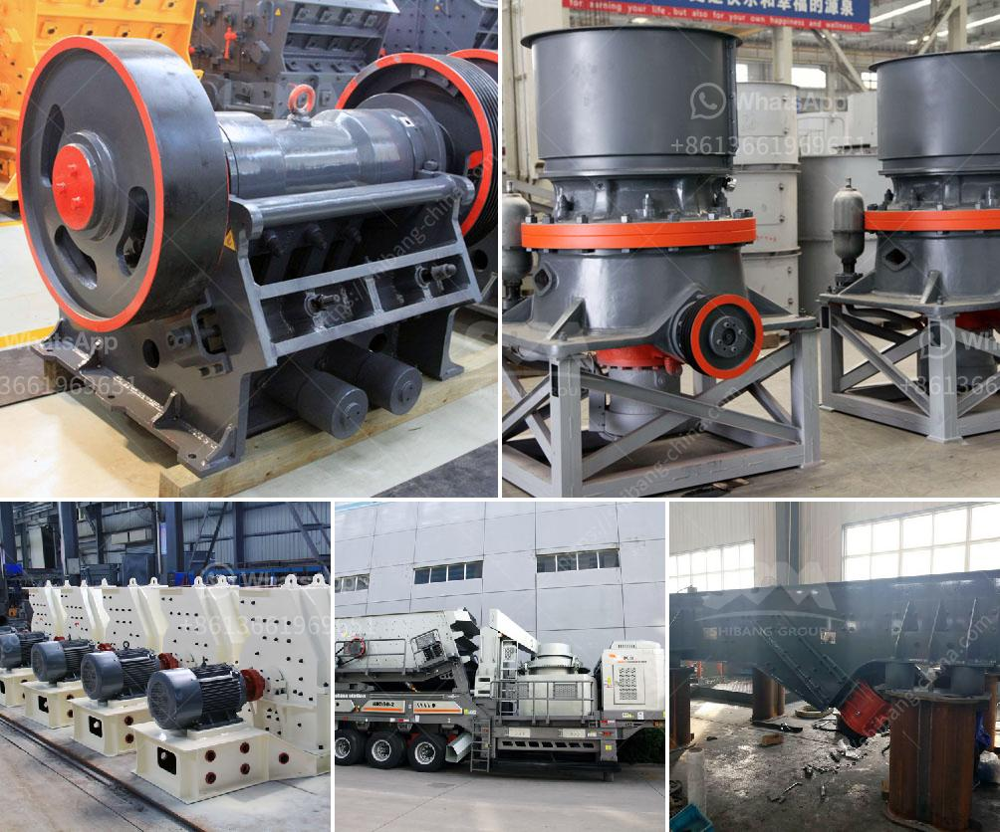

<h3>ball mill grinding media</h3>
Ball mill grinding media plays an important role in the production process of cement, metallurgy, mining, electric power, chemical, and other industries. It is the key grinding equipment in the material grinding process, and it becomes the grinding media when the ball mill works.

Grinding media are usually steels, ceramics, or natural stones, depending on the development of the industry over time. Grinding media help to break down solid materials into smaller pieces by changing the impact and grinding forces. They can be used to grind both soft and hard materials and achieve the desired fineness.

The selection of grinding media is crucial for the final quality of the product. The grinding media should be chosen based on the specific requirements of the material being ground, the grinding conditions, and the desired final particle size. There are several factors to consider when choosing the grinding media, including hardness, density, size, shape, and composition.

Hardness is the most important factor to consider when selecting grinding media. It determines how effectively the media can break down the material being ground. The hardness of grinding media is usually measured in terms of its Rockwell hardness or Brinell hardness. Steels with high hardness are commonly used as grinding media.

Density is another crucial factor to consider. Higher density grinding media can create more impacts and grinding forces, resulting in faster and more efficient grinding. Grinding media with high density can be made from high-density ceramics or high-density steel. Low-density grinding media are usually made from low-density ceramics or low-density steels.

Size and shape are also important factors to consider. The size of the grinding media affects the grinding efficiency and the final particle size. Smaller grinding media are more effective in grinding fine particles but may result in lower mill throughput. The shape of the grinding media is also important. Grinding media with sharp edges can create more impacts and grinding forces.

Composition is the last factor to consider. Grinding media can be made from different materials, including carbon steel, stainless steel, ceramics, and natural stones. The composition of the grinding media affects its corrosion resistance, wear resistance, and overall performance. Grinding media with high corrosion resistance are suitable for grinding corrosive materials, while grinding media with high wear resistance are suitable for grinding hard materials.

In conclusion, ball mill grinding media are crucial for the success of any grinding operation. The selection of grinding media should be based on factors such as hardness, density, size, shape, and composition. The chosen grinding media should have the right combination of properties to achieve the desired grinding results. With the right grinding media, a ball mill can produce high-quality powder and achieve efficient grinding.
<h3>Contact us</h3><ul><li><strong>Whatsapp:&nbsp;<a href="https://wa.me/8613661969651">+8613661969651</a></strong></li><li><a href="https://swt.shibang-china.com/?git&amp;zhl&amp;ball mill grinding media"><strong>Online Service(chat now)</strong></a></li></ul><h3>Related</h3><ul><li><a href='artificial marble manufacturing machineprocess india.md'>artificial marble manufacturing machineprocess india</a></li><li><a href='carbon black processing machine in delhi.md'>carbon black processing machine in delhi</a></li><li><a href='zinc ash crusher machine required.md'>zinc ash crusher machine required</a></li><li><a href='price of crusher machine.md'>price of crusher machine</a></li><li><a href='clinker grinding plant setup cost in india.md'>clinker grinding plant setup cost in india</a></li></ul>