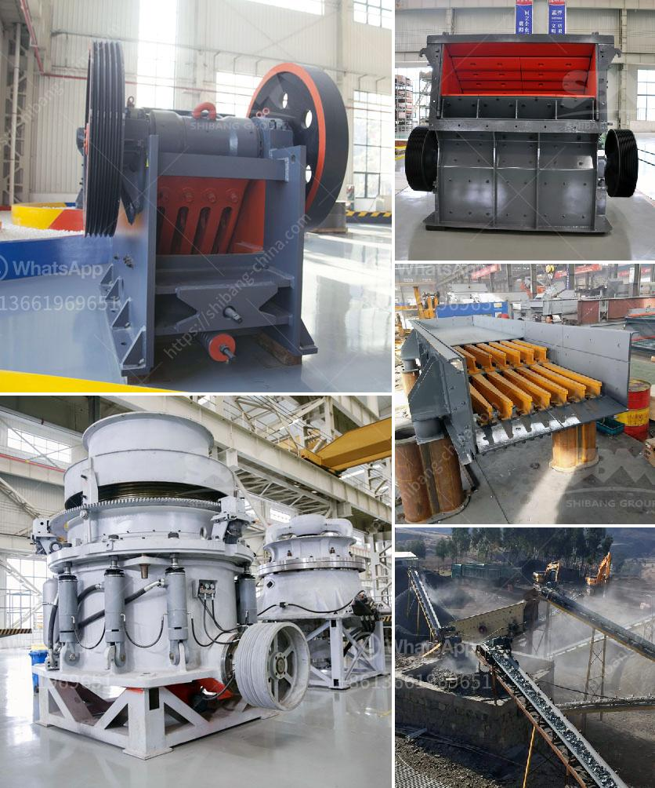

<h3>ball mill gypsum</h3>
Ball mill gypsum has been widely used in the construction industry for decades. As one of the most important building materials, it is commonly used in plasterboard, mortar, drywall, and other decorative finishes. In recent years, its popularity has increased due to its versatility and cost-effectiveness.

Ball mill gypsum is a versatile material, as it has an inherent fire resistance and can withstand high temperatures. It is also a good sound insulator, making it useful for reducing noise levels within a building. Additionally, it has excellent moisture resistance properties, which prevents the growth of mold and mildew.

The manufacturing process of ball mill gypsum involves crushing and grinding the mined gypsum ore into small particles. These small particles are then heated to evaporate any remaining water and produce the final gypsum product. The resulting powder is then mixed with water to create a paste-like consistency, which is applied to walls or ceilings and left to dry and set.

One of the main advantages of using ball mill gypsum is its ease of application. It can be easily mixed with water to form a smooth paste that can be spread evenly over surfaces. This ensures a uniform finish without any lumps or irregularities. Additionally, ball mill gypsum is easy to work with and can be easily shaped and molded into different designs or architectural features.

Another advantage of ball mill gypsum is its economic value. It is a cost-effective alternative to traditional building materials, such as cement or clay, as it is readily available and relatively inexpensive. This makes it a popular choice for both residential and commercial construction projects.

Ball mill gypsum is also environmentally friendly. It is a natural material that is abundant in nature and does not require extensive mining or extraction processes. Additionally, its production process generates less carbon emissions compared to other building materials, making it a sustainable choice.

In terms of durability, ball mill gypsum offers excellent performance. It is resistant to water and moisture, which ensures its longevity and prevents any damage caused by damp conditions. Furthermore, ball mill gypsum has good structural strength, making it suitable for supporting heavy loads and preventing cracks or deformations.

In conclusion, ball mill gypsum is a versatile and cost-effective building material that offers numerous benefits. Its ease of application, durability, and environmental friendliness make it a preferred choice in the construction industry. Whether used in plasterboard, mortar, or other decorative finishes, ball mill gypsum provides a high-quality and aesthetically pleasing solution for various building projects.
<h3>Contact us</h3><ul><li><strong>Whatsapp:&nbsp;<a href="https://wa.me/8613661969651">+8613661969651</a></strong></li><li><a href="https://swt.shibang-china.com/?git&amp;zhl&amp;ball mill gypsum"><strong>Online Service(chat now)</strong></a></li></ul><h3>Related</h3><ul><li><a href='crushing machines for rent in uae.md'>crushing machines for rent in uae</a></li><li><a href='vibrator machine for concrete.md'>vibrator machine for concrete</a></li><li><a href='ball mill for limestone.md'>ball mill for limestone</a></li><li><a href='technical specs 400mm x 600mm jaw crusher.md'>technical specs 400mm x 600mm jaw crusher</a></li><li><a href='barite powder manufacturing machinery.md'>barite powder manufacturing machinery</a></li></ul>